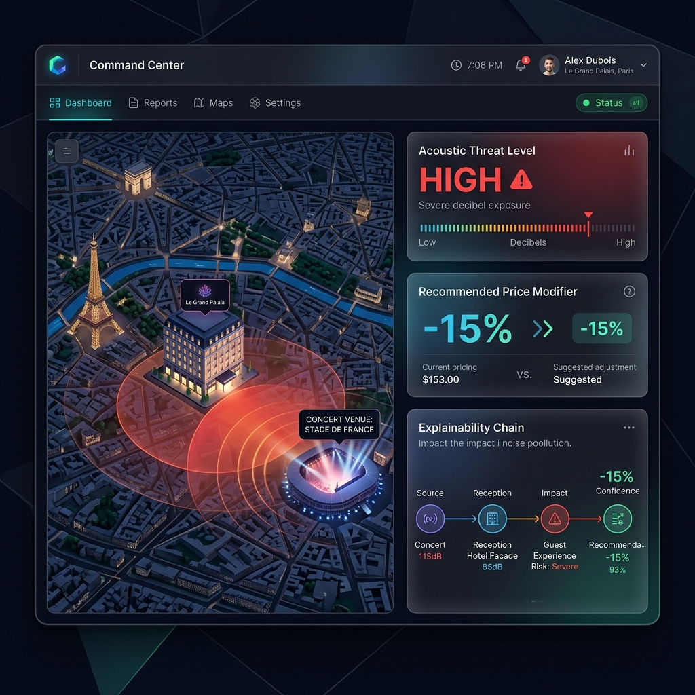

# Case Study: Tacet – The Hotel Environmental Risk & Comfort Twin

## 1. The Core Problem
Luxury hospitality is inherently reactive to its environment. A sudden transport strike, an unannounced street excavation, or a massive heatwave can drastically alter the guest experience and demand curves. 
Revenue Management Systems (RMS) and Property Management Systems (PMS) rely heavily on historical booking data. They are blind to the *physical* and *contextual* future of the property's immediate surroundings. This blindness leads to mispriced inventory, operational friction, and ultimately, guest dissatisfaction.

## 2. The Solution: Tacet
Tacet is a headless, predictive **Environmental Digital Twin**. It acts as the sentient sensory layer for a broader hospitality "Agentic Mesh". 

Rather than overwhelming the hotel staff with a dashboard of raw data, Tacet mathematically calculates the real-world impact of external events. It exposes this intelligence via an **MCP (Model Context Protocol)** server so that operational agents (like Aetherix) can adjust F&B/staffing, while Tacet pushes actionable yield rules directly to the RMS (like Atomize or Duetto).

*Live Demonstration of Tacet's API generating a spatial explainability chain:*

### Key Architectural Pillars

**A. The Spatial Physics Engine (Acoustic Ray-Tracing)**
Tacet doesn't just measure distance; it measures physics. Using Python libraries like `shapely` and `osmnx`, Tacet draws 3D lines of sight between a disruptive event (e.g., a jackhammer or a stadium crowd) and the hotel. It cross-references this path against urban building polygons. If a building blocks the sound, Tacet dynamically applies a shielding penalty. This prevents false positives and alert fatigue.

**B. The Dual Memory System (Idiosyncratic & Sensory Memory)**
A predictive engine must learn from its mistakes. Tacet features a built-in stateful database:
- **Idiosyncratic Memory:** If a specific hotel manager repeatedly rejects an automated alert for "Traffic Noise", Tacet learns that this specific building likely has triple-glazed windows. It automatically applies a persistent shielding bonus for future calculations at that exact GPS coordinate.
- **Sensory Memory:** A statistical aggregation engine constantly analyzes rejection rates across the global network of hotels to dynamically adjust the baseline sensitivity of the entire ecosystem.

**C. The Human-In-The-Loop (HITL) Guardrail**
Tacet is governed by a strict business rule: it never executes autonomous, destructive actions (like changing a price blindly). Instead, it computes a precise Yield Modifier mathematically linked to the severity of the physical disruption (e.g., *-8.0% for Street-Facing Suites based on a 10dB overflow*) and pushes it to the RMS for human approval.

**D. Conversational Explainability (The Headless Challenge)**
To guarantee transparency in a system without a GUI, Tacet generates a mathematical "Chain of Thought" in every JSON response. An orchestration agent (like Aetherix) can parse this payload and explain the exact physics (Base Noise -> Distance Attenuation -> Ray-Tracing Penalty -> Final Impact) to the Revenue Manager in natural language.

## 3. The Future Vision: The Environmental Command Center
While Tacet is designed as a headless agentic node, we envisioned what a premium "Command Center" interface would look like for a luxury hotel group. This vision combines 3D spatial mapping with actionable ESG and Yield metrics.

## 4. The Impact & ESG Alignment
By integrating Tacet into an Agentic OS, luxury hotels shift from a reactive posture to proactive yield and operational management. 
- **Yield Protection:** Automatically lowering prices on noisy inventory prevents costly post-stay refunds.
- **Operational Excellence (Aetherix Integration):** When Tacet detects an impending heatwave + transport strike, the orchestration layer automatically adjusts F&B supply and staffing buffers to prevent food waste and labor inefficiencies.
- **Measurable ESG KPIs:** 
  - Significant reduction in energy waste (e.g., proactive HVAC optimization based on micro-weather).
  - Quantitative improvement in guest well-being (proactive mitigation of urban noise pollution).

## 4. Technical Stack
- **Agentic Protocol:** Anthropic MCP (Model Context Protocol) SDK
- **Language:** Python 3.12
- **Framework:** FastAPI (REST, OpenAPI)
- **Database:** SQLAlchemy / SQLite
- **Spatial Processing:** OSMnx, Shapely, GeoPandas
- **Integrations:** OAuth2, Mews Open API, Apaleo API, RMS Webhooks
