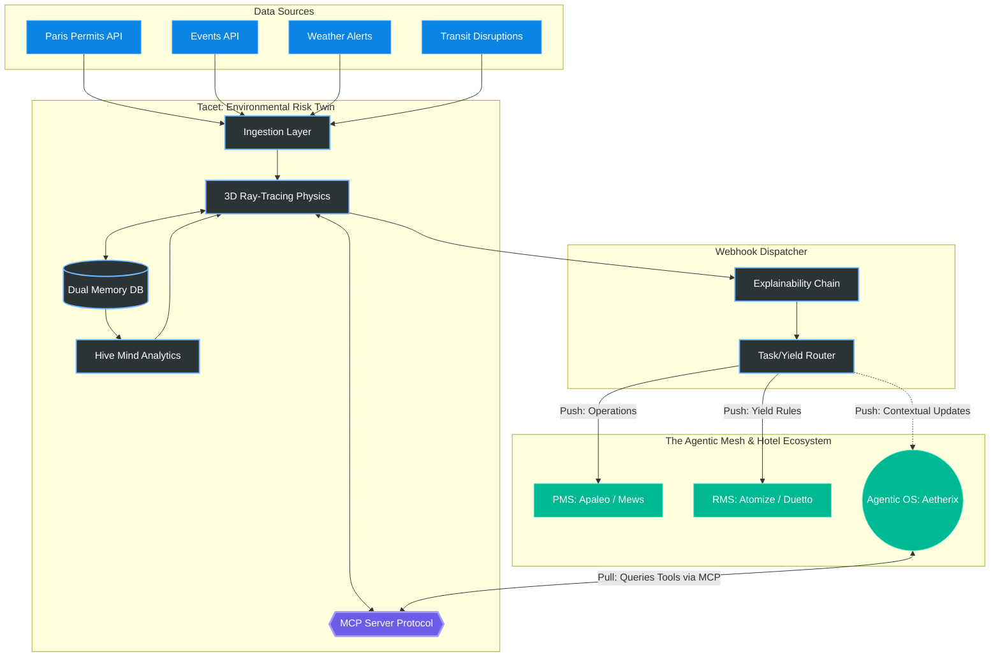

<div align="center">
  <h1>Tacet</h1>
  
  <p><em>Helping Hotel Revenue Managers predict their property's environmental exposure.</em></p>
  
  <p>
    
    
    
    
    
    
  </p>
</div>

---

## Overview
Tacet is an advanced, headless **Environmental Risk & Comfort Twin** for the luxury hospitality sector.
It functions as a sentient analytical layer that bridges chaotic external data (City Open Data, Weather, Traffic, Events) with Hotel Operations and Revenue Management Systems.
Tacet synthesizes spatial physics (3D acoustic ray-tracing) and real-time environmental context through a dual-memory system. It is designed from the ground up to proactively protect guest yield and comfort, and is callable by other agents via a native MCP (Model Context Protocol) server.

## 🗺️ Architecture Overview



## 🏗 Core Architecture & Engineering Highlights

This repository was architected to demonstrate modern, highly-scalable backend AI engineering patterns:

### 1. 3D Spatial Physics Engine (Acoustics)
- **Ray-Tracing:** Uses `shapely` and `osmnx` to draw mathematical lines of sight between a disruptive event (e.g., a jackhammer or a stadium concert) and the target hotel.
- **Physical Shielding:** Cross-references the ray-trace against 3D urban building polygons. If a building intersects the line of sight, a dynamic `-15 dB` shielding penalty is applied to the inverse-square law attenuation formula.

### 2. Dual Memory Systems (Idiosyncratic & Hive Mind)
Tacet is not a stateless script; it possesses a learning feedback loop powered by `SQLAlchemy` and `SQLite`.
- **Idiosyncratic Memory (Local):** If a specific hotel's manager repeatedly rejects an automated alert for "Traffic Noise," Tacet learns that this specific building likely has triple-glazed windows. It automatically applies a persistent `+2.0 dB` shielding bonus for future calculations at that exact GPS coordinate.
- **Hive Mind (Global):** A statistical aggregation engine (`app/services/hive_mind.py`) constantly analyzes rejection rates across the entire global network of hotels to dynamically adjust baseline ecosystem sensitivities.

### 3. The Agentic Mesh & MCP Server
Tacet is fully integrated into the modern Agentic OS paradigm. It exposes a native **Model Context Protocol (MCP)** server (`app/mcp_server.py`).
- **Composable Capabilities:** Other agents (like Aetherix for F&B/Staffing) or LLMs (Claude) can seamlessly query Tacet via the `get_environmental_risk_profile` tool.
- **Explainability Chains:** To guarantee transparency in a headless system, every JSON payload includes a mathematical "Chain of Thought" (`explainability_chain`), allowing an LLM to read the raw data and explain the physics to a human in natural language.

### 4. Enterprise Integrations & The HITL Guardrail
Tacet adheres strictly to a **Human-In-The-Loop (HITL)** philosophy. It never executes autonomous destructive actions.
- **Native PMS Tasks:** Implements OAuth2 and secure connectors (`mews_client.py`, `apaleo_client.py`) to push `CRITICAL` warnings directly into the hotel staff's operational dashboard as native tasks.
- **The RMS Contract:** Generates universal Yield Management rules (`TacetRMSPayload`) designed for immediate ingestion by systems like Duetto or Atomize (e.g., *"-15% price modifier for Street Facing Suites between June 12-14"*).

## 🔌 Data Ingestion Ecosystem

Tacet ingests and standardizes chaotic external data into actionable intelligence:
- **Planned Construction:** Paris Open Data (Predictive date filtering)
- **Crowd Events:** "Que Faire à Paris" API (Stadium/Concert noise)
- **Real-Time Traffic:** TomTom API Congestion ratios
- **Logistical Disruptions:** Transit Strikes (RATP) & Extreme Weather Alerts

## 🚀 Tech Stack

- **Framework:** Python 3.12, FastAPI
- **Database:** SQLAlchemy / SQLite
- **Spatial Math:** OSMnx, Shapely, GeoPandas
- **Deployment:** Stateless webhook dispatching architecture

## 🧪 How to Test Locally

Tacet is a headless engine. The easiest way to test its capabilities is via the auto-generated Swagger UI.

1. **Install dependencies:**
   ```bash
   pip install fastapi uvicorn requests shapely osmnx geopandas sqlalchemy
   ```
2. **Start the server:**
   ```bash
   uvicorn app.main:app --reload
   ```
3. **Run a Predictive Forecast:**
   Open your browser and navigate to `http://127.0.0.1:8000/docs`. 
   Use the `POST /api/v1/forecast` endpoint with the following test payload:
   ```json
   {
     "hotel_id": "TEST_PARIS_1",
     "coordinates": {
       "lat": 48.8786,
       "lon": 2.3771
     },
     "start_date": "2026-06-01",
     "end_date": "2026-06-15"
   }
   ```
   *Look at the `explainability_chain` in the response to see the Ray-Tracing math in action!*

## 🤖 How to use the MCP Server (Agentic Mesh)
Tacet can act as a "Sensory Node" for other AI Agents. You can run the official MCP server:
```bash
python -m app.mcp_server
```
Once running via `stdio` or SSE, any compatible LLM or orchestrator (like Claude Desktop) can dynamically call the `get_environmental_risk_profile` tool to fetch live spatial intelligence.

## 💡 Use Case Example & ESG Impact

**The Problem:** A massive heatwave and a music festival coincide near a luxury hotel next July.
**Tacet's Execution:**
1. Fetches the events via the Event API and Meteo API.
2. Calculates that the concert will generate `100 dB` of noise at the source.
3. Performs a 3D Ray-Trace and confirms no buildings block the sound path.
4. Queries the Idiosyncratic DB and sees this hotel has standard windows.
5. Calculates the sound wave will hit the hotel at `55 dB` (Highly Disruptive).
6. **Agentic Mesh Action:** Dispatches a JSON payload to the RMS recommending a `-10% Price Yield` on street-facing rooms. The orchestrator (Aetherix) reads the payload and automatically adjusts F&B supply and staffing buffers due to the heatwave.

**ESG KPIs Supported:**
- % Reduction in energy waste (HVAC optimization preempting weather events).
- Improvement in guest well-being and complaint reduction regarding urban noise pollution. 
