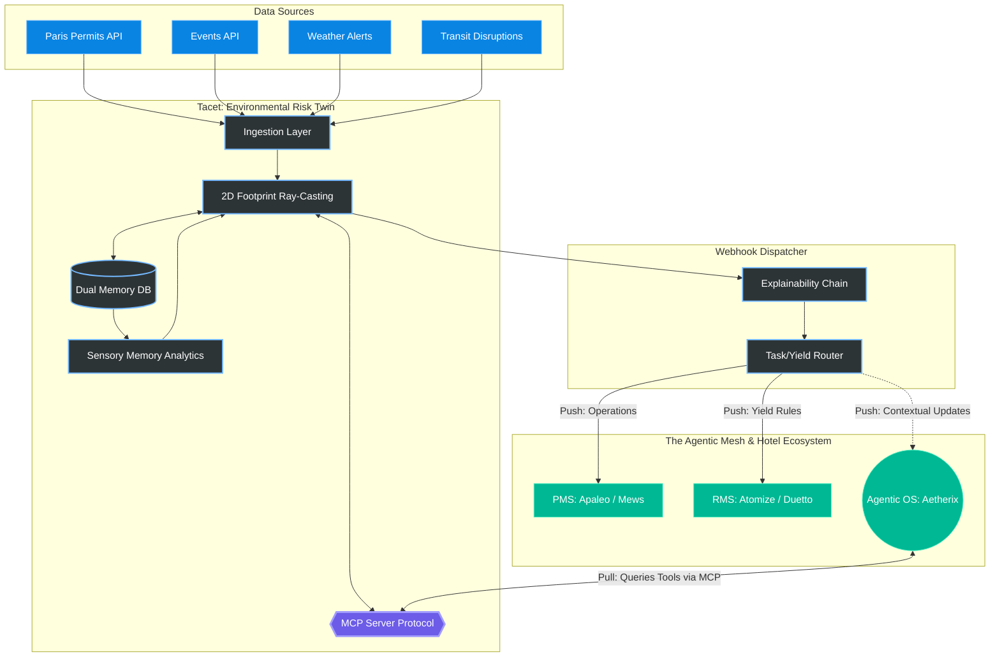

<div align="center">
  <h1>Tacet</h1>
  
  <p><em>Predict and monetize environmental exposure for Luxury Hospitality.</em></p>
  
  <p>
    
    
    
    
    <br>
    
    
  </p>
</div>

---

> **🕸️ Part of the [Hospitality Agentic Mesh](https://github.com/IvandeMurard/hospitality-agentic-mesh)** — a network of specialized AI agents for hotel operations. Tacet is the environmental-risk node; the F&B execution node (Aetherix, private repo) and the overall architecture are documented in the [meta-repo](https://github.com/IvandeMurard/hospitality-agentic-mesh) and the [case study](https://ivandemurard.com/aetherix).

## Overview

Tacet is an **Environmental Risk & Comfort Twin** designed to protect luxury hotels from urban unpredictability (noise, construction, crowds, weather). 

For a Revenue Manager or Hotel Operator, the city is a chaotic external risk factor that often leads to guest complaints or lost revenue. Tacet solves this by predicting exactly how external events will physically impact the property, and automatically translating these risks into **actionable business outputs**:
- **Yield Protection:** Dynamic pricing rules pushed to the RMS (e.g., preemptively adjusting the price of a street-facing suite during a marathon).
- **Operational Excellence:** Alerts pushed to the PMS to adapt room assignments or F&B staffing.

Tacet runs seamlessly in the background as a headless service, and is fully integrated into the Agentic ecosystem via a native MCP (Model Context Protocol) server.

## 🗺️ Architecture Overview



## 🏗 Core Architecture: a Predictive Acoustic Picture of the Neighborhood

The city around a hotel is chaotic and opaque by default. Tacet uses simple, explainable physics to build a **live, predictive acoustic picture** of the property's surroundings, so that revenue and operations teams see disruptions coming instead of reacting to complaints.

### 1. Edge-First Spatial Physics (Acoustics)
- **Heatmap Caching:** To guarantee `< 100ms` API latency, 2D ray-casting over OpenStreetMap building footprints (`shapely`, `osmnx`) is pre-computed into a local polar heatmap (360 rays, one per compass degree). The run-time engine queries this cache instead of performing synchronous geometrical math.
- **Physical Shielding:** If a building footprint intersects the line of sight during pre-computation, a shielding penalty is mapped to that directional vector. This is a 2D model: building heights are fetched but not yet used in the ray test.

### 2. Pattern of Life (Idiosyncratic Memory)
Tacet abandons absolute thresholds (e.g., "70 dB is loud"). It operates entirely on contextual anomalies.
- **The Baseline:** The local `SQLite` database stores the specific acoustic "Pattern of Life" for the hotel (e.g., a baseline of 60 dB for a busy avenue). 
- **Anomaly Detection:** Tacet only triggers an alert if a disruptive event deviates significantly from this historical baseline (e.g., an unexpected +15 dB spike).

### 2.5 Multi-Property Detection Sharing — *roadmap, not implemented*
The intended design for hotel groups with multiple properties in a city: Tacet nodes share *disruption detections* with each other. If Hotel A detects an unmapped protest moving down a street, it alerts Hotel B to calculate its own impact. Nodes would share the detection but isolate the impact evaluation. **No code exists for this yet** — it is documented here as a design target only.

### 3. The Agentic Mesh & MCP Server
Tacet is fully integrated into the modern Agentic OS paradigm. It exposes a native **Model Context Protocol (MCP)** server (`app/mcp_server.py`).
- **Composable Capabilities:** Other agents (like Aetherix for F&B/Staffing) or LLMs (Claude) can seamlessly query Tacet via the `get_environmental_risk_profile` tool.
- **Explainability Chains:** To guarantee transparency in a headless system, every JSON payload includes a mathematical "Chain of Thought" (`explainability_chain`), allowing an LLM to read the raw data and explain the physics to a human in natural language.

### 4. Enterprise Integrations & The HITL Guardrail
Tacet adheres strictly to a **Human-In-The-Loop (HITL)** philosophy. It never executes autonomous destructive actions.
- **Native PMS Tasks:** Implements OAuth2 and secure connectors (`mews_client.py`, `apaleo_client.py`) to push `CRITICAL` warnings directly into the hotel staff's operational dashboard as native tasks.
- **The RMS Contract:** Generates universal Yield Management rules (`TacetRMSPayload`) designed for immediate ingestion by systems like Duetto or Atomize (e.g., *"-15% price modifier for Street Facing Suites between June 12-14"*).

## 🔌 The Abstraction Layer (Data Ingestion)

Tacet features an **Agnostic Ingestion Layer** designed to absorb chaotic, multi-format external data (JSON, XML, municipal APIs) and normalize it into a universal `DisruptiveEvent` object. The physics engine only consumes this standardized format, allowing global deployment without rewriting core logic:
- **Planned Construction:** Paris Open Data, NYC OpenData, etc.
- **Crowd Events:** "Que Faire à Paris" API, Ticketmaster APIs.
- **Real-Time Traffic:** TomTom / Waze congestion ratios.
- **Logistical Disruptions:** Transit Strikes & Extreme Weather Alerts.

## 🚀 Tech Stack

- **Framework:** Python 3.12, FastAPI
- **Database:** SQLAlchemy / SQLite
- **Spatial Math:** OSMnx, Shapely, GeoPandas
- **Deployment:** Stateless webhook dispatching architecture

## 🧪 How to Test Locally

Run the unit tests (acoustic engine: haversine, bearing, heatmap, shielding, attenuation, severity matrix):
```bash
pip install pytest shapely sqlalchemy pydantic
python -m pytest tests/ -q
```

Tacet is a headless engine. The easiest way to explore its capabilities is via the auto-generated Swagger UI.

1. **Install dependencies:**
   ```bash
   pip install fastapi uvicorn requests shapely osmnx geopandas sqlalchemy
   ```
2. **Start the server:**
   ```bash
   uvicorn app.main:app --reload
   ```
3. **Run a Predictive Forecast:**
   Open your browser and navigate to `http://127.0.0.1:8000/docs`. 
   Use the `POST /api/v1/forecast` endpoint with the following test payload:
   ```json
   {
     "hotel_id": "TEST_PARIS_1",
     "coordinates": {
       "lat": 48.8786,
       "lon": 2.3771
     },
     "start_date": "2026-06-01",
     "end_date": "2026-06-15"
   }
   ```
   *Look at the `explainability_chain` in the response to see the Ray-Tracing math in action!*

## 🤖 How to use the MCP Server (Agentic Mesh)
Tacet can act as a "Sensory Node" for other AI Agents. You can run the official MCP server:
```bash
python -m app.mcp_server
```
Once running via `stdio` or SSE, any compatible LLM or orchestrator (like Claude Desktop) can dynamically call the `get_environmental_risk_profile` tool to fetch live spatial intelligence.

## 💡 Use Case Example & ESG Impact

**The Problem:** A massive heatwave and a music festival coincide near a luxury hotel next July.
**Tacet's Execution:**
1. Fetches the events via the Event API and Meteo API.
2. Calculates that the concert will generate `100 dB` of noise at the source.
3. Queries the pre-calculated Edge Heatmap and confirms no buildings block the sound path.
4. Queries the Idiosyncratic DB and reads the hotel's "Pattern of Life" baseline (e.g., usually 50 dB at this time).
5. Calculates the sound wave will hit the hotel at `65 dB`, resulting in a **+15 dB severe anomaly**.
6. **Agentic Mesh Action (Intent-to-Task):** Dispatches a JSON payload to the Orchestrator (Aetherix) highlighting the anomaly. Aetherix translates this into a PMS Task (rescheduling housekeeping) and pushes a `-15% Yield Modifier` rule to the RMS for street-facing rooms.

**ESG KPIs Supported:**
- % Reduction in energy waste (HVAC optimization preempting weather events).
- Improvement in guest well-being and complaint reduction regarding urban noise pollution. 
