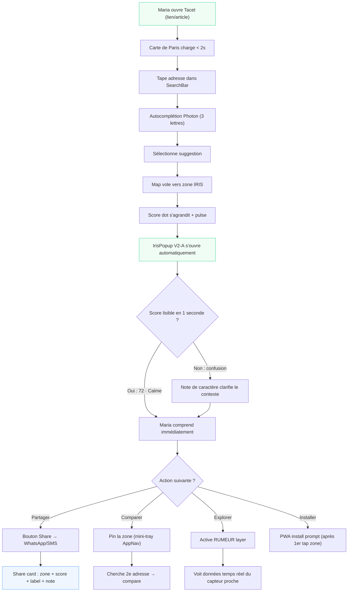
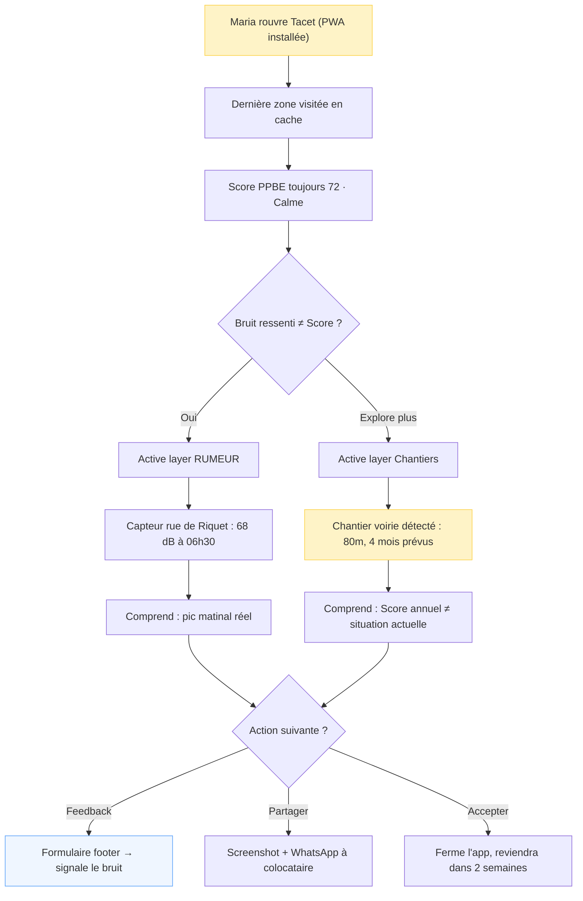
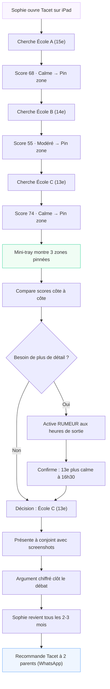

# UX Design Specification Tacet

**Author:** IVAN
**Date:** 2026-02-28

---

<!-- UX design content will be appended sequentially through collaborative workflow steps -->

## Executive Summary

### Project Vision

Tacet V2 is the first B2C urban companion making Paris's acoustic data beautiful, readable, and actionable. The core UX premise: same Bruitparif data as institutional portals, opposite emotional register. Where AirParif creates anxiety through density and technical framing, Tacet creates serenity through progressive disclosure, positive scoring, and a calm-first visual language.

V1 established the foundation: dark glass-morphism UI, teal brand identity (#0D9488), 4-tier noise choropleth (green/amber/red/violet), IrisPopup with score + day/night dB + share. V2 is a clean-slate redesign opportunity — extending and refining V1 patterns rather than starting from zero.

**Strategic deadline**: Q2 2026, before Paris municipal elections where urban noise is an explicit campaign issue. Tacet is the only consumer product making this data beautiful. The UX must be good enough to be shared organically before the media window opens.

### Target Users

**Maria, 36 — La Future Habitante (primary)**
- Apartment hunter in active search, high-intent, one-time decision context
- Core job: "Is this neighborhood calm enough to sign a 3-year lease?"
- Success: answers confidently in < 5 minutes, without acoustic expertise
- Key moment: taps zone → reads Score → compares 2 addresses → screenshots and WhatsApp-shares
- Device: mobile (primary), converts to PWA install
- Tech-savviness: moderate, non-technical

**Sophie, 42 — La Mère Attentive (secondary)**
- Parent monitoring school routes and neighborhood environments for children
- Recurring user (every 2–3 months), high organic advocacy rate
- Uses mobile + tablet (iPad)
- Key behavior: compares 3+ zones per session, shares to parent WhatsApp groups

### Key Design Challenges

1. **Score legibility without explanation** — The Score Sérénité (0–100) combined with the 5-tier label system ("Très calme / Calme / Modéré / Bruyant / Très bruyant") must be instantly comprehensible without any onboarding. Color, number, and label must cohere as one unified signal. V1 uses 4 tiers; V2 adds "Très calme" as a fifth tier for high-serenity zones.

2. **Data layer trust and clarity** — Three data types coexist on the map: PPBE annual (slow, authoritative), RUMEUR real-time (fast, sensor-based), Chantiers events (dynamic). Users must understand at a glance which data they are reading, when it was last updated, and whether it reflects current conditions — without a manual or tooltip sequence.

3. **Map + RGAA accessibility (≥ 95)** — Full-screen WebGL canvas (MapLibre) requires a complete keyboard-navigable text alternative per RGAA requirements. This must be designed as a first-class screen, not an afterthought, and must not degrade the primary visual experience.

4. **Mobile screen real estate** — SearchBar, layer toggles, IrisPopup, RUMEUR indicators, legend, PWA install prompt, and AppNav all compete on a 375px mobile screen. The interaction model must enforce strict hierarchy: one primary action surface visible at a time.

5. **Expert mode toggle** — Dual display mode (label tier for casual users / precise dB numbers for power users) needs a clear UI home that rewards depth without confusing Maria.

### Design Opportunities

1. **Calm-first visual language (clean slate)** — V2 is a visual redesign opportunity. The dark glass-morphism of V1 is a solid foundation. V2 can evolve toward warmer tones, more generous white space, and softer gradients — defining what "environmental data that feels like a premium travel companion" looks like, not what an institutional monitoring dashboard looks like.

2. **Zone character notes as editorial differentiator** — A pre-curated one-sentence "character note" per IRIS zone adds human warmth that no institutional portal has. Styled as editorial/italic, visually distinct from data fields. Example: *"Quartier animé du 11e — nuits festives autour d'Oberkampf, mais intérieurs d'îlots très préservés."* Implemented as static pre-generated copy to keep infrastructure cost at $0. *(Open decision: per-arrondissement for V2 / per-IRIS for V2.1; character-only vs. character + data caveat when relevant.)*

3. **Share payload as acquisition design** — Maria's WhatsApp screenshot is an explicit organic acquisition loop. The IrisPopup must be designed to produce a beautiful, legible screenshot: zone name, Score, label, and character note composing into a shareable visual card.

4. **Progressive disclosure architecture** — Score Sérénité as the single upfront answer; RUMEUR, Chantiers, expert dB values, noise factors, and character notes all accessible on demand. The default view serves Maria (one number, one label, one action). Power users and Sophie's multi-zone comparison mode are one tap deeper.

---

## Core User Experience

### Defining Experience

The core loop of Tacet is three steps:

> **Search address → Zone auto-highlights + IrisPopup auto-opens → Score Sérénité reads immediately**

Everything else — layers, comparison, expert mode, character notes — is depth around this moment. Getting this 3-step path completely effortless, in under 5 seconds, is the singular design mandate for V2.

**The core action that must be perfect:** After typing an address and selecting a suggestion, the map flies to the zone and the IrisPopup opens automatically, with no additional tap required. Maria sees the Score the instant the map lands.

**Lightweight saved zones (V2 scope):** Users can pin up to 3 zones during a session for side-by-side comparison. This supports Sophie's multi-zone decision flow (3 schools, 3 neighborhoods) without requiring an account or persistent state.

### Platform Strategy

| Dimension | Decision |
|-----------|----------|
| Primary platform | Mobile PWA (375px, touch-first) |
| Secondary platform | Tablet (768px, iPad — Sophie's use case) |
| Desktop | Supported, not primary design target |
| Install | PWA (no app store) — install prompt after first zone tap |
| Offline | Serwist: last visited zone cached, offline banner shown |
| Accounts | None in V2 — zero signup friction |
| Layer controls | Inside bottom AppNav (existing pattern, no new surface) |

### Effortless Interactions

The following interactions must require **zero cognitive load** — they should feel like natural extensions of looking at the map:

1. **Address → Score in one gesture** — Search input + zone auto-open = no tap between "I found the address" and "I see the score"
2. **Score legibility** — The number, color, and label (e.g., "72 · Calme") must be readable in one glance with no acoustic expertise
3. **PWA install** — Triggered after first zone tap (first meaningful action = user has seen value, install feels earned not intrusive)
4. **Share** — Native share sheet, activated from the IrisPopup — no intermediate screen, no account required
5. **Zone pin (saved zones)** — Single tap to pin/unpin a zone; pinned zones accessible from a persistent mini-tray in the AppNav area

### Critical Success Moments

| Moment | User | What must happen |
|--------|------|-----------------|
| **Auto-reveal** | Maria | Taps address suggestion → map flies → panel opens → Score visible. Zero extra taps. |
| **Instant legibility** | Maria | Reads "72 · Calme" in 1 second with no prior knowledge of Lden or PPBE |
| **First comparison** | Sophie | Pins zone A, taps zone B — sees both scores in AppNav mini-tray, makes her decision |
| **PWA install** | Maria | Sees score on first zone tap → install prompt appears → taps "Ajouter à l'écran d'accueil" naturally |
| **Share moment** | Maria | Taps Share → WhatsApp preview shows score + zone name + label → friend opens link → they also discover Tacet |
| **Data trust** | Both | Layer type (PPBE / RUMEUR / Chantiers) and data freshness visible at a glance — no confusion about "is this up to date?" |

### Experience Principles

1. **Zero friction to insight** — Search → Score in one gesture, no intermediate screens, no acoustic expertise required. Time-to-insight target: < 5 seconds from address entry.

2. **One signal, one action** — At any moment the UI has one primary thing to read (the Score) and one primary thing to do (compare, share, or install). Secondary surfaces never compete with the primary one.

3. **Depth on demand** — Everything beyond the Score (RUMEUR, Chantiers, noise factors, expert dB, character notes, Baromètre) is accessible but never imposed. Maria's default path never touches any of these.

4. **Trust through transparency** — Data type (annual PPBE / real-time RUMEUR / event Chantiers), data vintage, and known limitations are always visible but presented calmly — as context, not as warnings.

5. **Designed to be shared** — Every state the app can produce must look beautiful as a screenshot. The IrisPopup layout is a shareable visual card first, an information panel second.

---

## Desired Emotional Response

### Primary Emotional Goals

**Core emotional target: Calm confidence.**

Tacet must make users feel two things simultaneously:
- **Calm** — the data does not alarm, overwhelm, or create anxiety, even when a zone is noisy. The opposite of AirParif.
- **Confident** — the user feels equipped to act on what they just read. Not just informed, but empowered.

The product name itself — Tacet (musical silence) — sets the emotional register. Every design decision should ask: "Does this feel like silence, or does it add noise?"

**What would make Maria tell a friend:** *Surprise at how simple it was.* She expected a government portal. She got a calm, beautiful answer in 10 seconds. That gap — between expectation and reality — is the share trigger.

### Emotional Journey Mapping

| Stage | Emotion | Design goal |
|-------|---------|-------------|
| **Discovery** (article/share link) | Curiosity — *"Is this the tool that actually explains noise data?"* | First screen must deliver on the promise within 3 seconds |
| **Map loads** (Paris choropleth appears) | Orientation + mild wonder — *"It's like a noise weather map"* | Color gradient must feel calm, not alarming — even the "Bruyant" red should feel soft |
| **Score auto-reveals** (IrisPopup opens) | **Relief + clarity** — *"72 · Calme. I understand this."* | The score is the payoff — it must be the visual center of the panel |
| **Comparison** (pins zones) | Agency + confidence — *"I'm making a data-backed decision"* | Comparison tray must feel like a natural research tool, not a technical feature |
| **Task complete** (decides/shares) | **Relief + pride** — *"I found my answer. I can act."* | Share button placement and share card design amplify this moment |
| **Degraded state** (RUMEUR offline) | Informed acceptance — *"Real-time is unavailable, but I still have the annual data"* | Error/fallback states must be calm, not alarming — context not warnings |
| **Return visit** (Sophie, week 2) | Familiarity + trust — *"This is my noise companion. I know how to read it."* | Consistent UI — no surprises on return, interface feels like a reliable tool |

### Micro-Emotions

The following micro-emotional pairs define the design guardrails — Tacet must always land on the left side:

| Design for ✅ | Avoid ❌ |
|---|---|
| **Confidence** when reading the Score | Confusion about what the number means |
| **Trust** in data quality and limitations | Skepticism — "Is this real? Is it up to date?" |
| **Calm** when seeing a noisy zone | Anxiety — "My neighborhood is dangerous" |
| **Delight** at the character note | Mere satisfaction — the editorial warmth should surprise |
| **Agency** when comparing zones | Overwhelm — too many data points at once |
| **Clarity** about data type (PPBE vs RUMEUR) | Confusion about which data is being displayed |

### Design Implications

| Emotional goal | UX / visual design approach |
|---|---|
| **Calm** | Warm palette evolution from V1 teal. Soft gradients on choropleth — even "Très bruyant" violet should not feel alarming. No red-alert UI metaphors, no warning triangles. Score displayed as serenity (higher = better), never as noise level (higher = worse). |
| **Confidence** | Score Sérénité as the unambiguous top-line signal — large number, clear label, clear color. Never compete with raw dB on first view. One primary signal. |
| **Trust** | Data provenance (Bruitparif, année 2024) always visible but in muted, small typography — footer-level, never banner-level. RUMEUR timestamp shown as a confidence indicator, not a freshness warning. |
| **Delight** | Character note styled in italic, slightly muted tone — an editorial whisper, not a data field. Beautiful share card layout that looks intentionally designed. "Très calme" tier as an aspirational reward. |
| **Agency** | Zone comparison tray feels like a research notebook — pinning a zone is a natural gesture, not a settings action. Expert mode toggle is discoverable but non-intrusive. |

### Emotional Design Principles

1. **Serenity is the product** — Not the map. Not the data. The emotional experience of finally understanding your acoustic environment without anxiety. Every pixel should serve this.

2. **The score is the answer** — Maria doesn't want to understand acoustics. She wants to know if she can sleep. The Score Sérénité delivers that answer, and the rest of the UI must support rather than compete with it.

3. **Calm degradation** — When things go wrong (RUMEUR down, offline mode, data stale), the response is calm context, not alarming error states. Users should feel informed, not abandoned.

4. **Earned delight** — Surprise and delight come from the character notes and the share card quality — both reveal that Tacet was built with care. This is not a government portal.

5. **Trust through restraint** — We show less than we could. Every data field we don't show by default is a decision to protect the user's emotional state. Depth is always one tap away; it is never the default view.

---

## UX Pattern Analysis & Inspiration

### Inspiring Products Analysis

**1. Citymapper — Information clarity model**
Translates complex multi-modal transit data into one instantly readable answer per query ("Your bus in 4 min"). The map is context; the panel is the answer. Ruthless information hierarchy — nothing competes with the primary response. Users never need to interpret raw data.
*Tacet takeaway:* Score Sérénité IS Tacet's "4 min." The IrisPopup is the answer surface. The map is context, not the product.

**2. Apple Weather — Technical-to-human translation**
"Feels like 12°C" removes the expertise barrier entirely (no one needs to understand barometric pressure). Layered architecture: summary → hourly → 10-day → radar. Each layer adds depth without imposing it on the default view.
*Tacet takeaway:* "Score 72 · Calme" = "feels like 12°." Expert mode (raw dB) = the hourly detail tap. The abstraction IS the product.

**3. Airbnb — Premium aesthetic on a data-heavy product**
Editorial neighborhood descriptions that add human warmth to data-driven content. Listing cards designed to produce beautiful screenshots — the shareable artifact is a first-class design concern. Bottom sheet over map on mobile. Premium feel that doesn't sacrifice information density.
*Tacet takeaway:* Character notes = neighborhood descriptions. IrisPopup layout = shareable listing card. Bottom sheet over map = established pattern Maria already trusts.

**4. Google Maps place card — Familiar zero-tap mobile pattern**
Tap a place → bottom sheet slides up immediately with name, rating, category, actions. Zero additional tap between "I see it on the map" and "I have the information." Saved places tray in nav. One-tap share.
*Tacet takeaway:* IrisPopup auto-reveal = place card slide-up. Score = rating. Zone pin = saved place. Maria already knows this interaction model.

### Transferable UX Patterns

| Pattern | From | Application in Tacet |
|---|---|---|
| **Single proxy metric as top-line signal** | Citymapper, Weather | Score Sérénité 0–100 before any raw dB |
| **Bottom sheet / card slide-up on map tap** | Google Maps, Airbnb | IrisPopup auto-reveal after address search |
| **Progressive disclosure: summary → detail** | Apple Weather | Score → day/night → noise factors → expert dB |
| **Shareable card as primary design constraint** | Airbnb | IrisPopup layout designed to screenshot beautifully |
| **Editorial neighborhood voice** | Airbnb | Character notes — italic, editorial, distinct from data fields |
| **Persistent saved items tray in nav** | Google Maps | Zone comparison mini-tray in AppNav |
| **Layer toggle as secondary surface** | Citymapper | AppNav layer controls — never interrupting the map |

### Anti-Patterns to Avoid

| Anti-pattern | Source | Why to avoid |
|---|---|---|
| **Raw data as primary display** | AirParif, Bruitparif portals | Requires acoustic expertise; creates anxiety |
| **Warning-colored UI for noisy data** | Environmental monitoring dashboards | Triggers alarm response; opposite of emotional goal |
| **Map overcluttered with pins/markers** | Early map aggregators | Visual noise; destroys the calm choropleth effect |
| **Multi-step share flow** | Many apps | Kills Maria's WhatsApp moment; share must be one tap |
| **Data tables without proxy abstraction** | SeLoger, PAP, PPBE portals | Requires expertise; no human-readable signal |
| **Windy-style data density** | Windy.com | Visually impressive but overwhelming; defeats calm-first goal |
| **Feature-driven navigation** | Enterprise dashboards | Users accomplish goals, not browse features |

### Design Inspiration Strategy

**Adopt directly:**
- Bottom sheet card slide-up on map interaction (universal pattern, Maria already knows it)
- Single proxy metric as unambiguous top-line signal
- Shareable card composition as a primary design constraint alongside information display

**Adapt for Tacet:**
- Airbnb editorial voice → character notes that are shorter and more data-contextualized (honest neighborhood whisper, not marketing copy)
- Weather progressive disclosure → Score → day/night indicators → noise source factors → expert dB behind a toggle
- Google Maps "Save place" → Session-only zone pin in V2 (sessionStorage, no account)

**Deliberately reject:**
- Any alarm/warning metaphor from environmental monitoring tools, even for high-noise zones
- Data before proxy — raw dB must never appear before the Score Sérénité
- Onboarding flows — the interface must be self-explanatory from first interaction

---

## Design System Foundation

### Design System Choice

**shadcn/ui + Tailwind CSS** — Tacet V2 will use shadcn/ui as its component foundation, built on Radix UI primitives and Tailwind CSS utilities.

shadcn/ui components are code-owned: installed directly into the project (not imported from a package), which means full control over every component's visual behavior — critical for V2's calm-first aesthetic evolution from V1's glass-morphism.

### Rationale for Selection

- **Already in project** — V1 uses Tailwind CSS (confirmed in `tacet/tailwind.config.ts`). shadcn/ui is the natural extension, not a migration.
- **RGAA compliance** — Radix UI primitives (the foundation of shadcn/ui) are built with WCAG 2.1 AA / ARIA compliance by default. This directly supports the RGAA ≥ 95 requirement without custom accessibility work on standard components.
- **Code ownership** — Components live in `/components/ui/`, fully editable. The glass-morphism patterns from V1 (`backdrop-blur-xl`, `bg-black/65`, `border-white/15`) can be preserved or evolved without fighting an opaque library.
- **Solo dev velocity** — shadcn/ui's "add what you need" model keeps the bundle lean. For a solo developer targeting Q2 2026, this is faster than a full design system adoption and more consistent than pure Tailwind ad-hoc styling.
- **Theming via CSS variables** — Tacet's design token layer (Score tiers, brand teal, glass-morphism tokens) maps cleanly onto shadcn/ui's CSS variable system.

### Implementation Approach

shadcn/ui handles **non-map UI** only. The MapLibre GL JS canvas, choropleth layers, and zone interaction remain custom-coded using MapLibre's API — shadcn/ui is not involved in the map rendering pipeline.

Component scope:
- **SearchBar** — shadcn/ui `Command` or `Combobox` pattern for address autocomplete
- **IrisPopup** — Custom component, styled with Tailwind + Tacet tokens; shadcn/ui `Badge` for tier label, `Separator` for section dividers
- **AppNav** — Custom floating nav, shadcn/ui `Toggle` for layer switches, `Button` for actions
- **OfflineBanner** — shadcn/ui `Alert` variant (calm, not alarming)
- **PWA install prompt** — shadcn/ui `Dialog` or custom bottom sheet
- **Zone comparison mini-tray** — Custom, sessionStorage-backed

### Customization Strategy

A Tacet design token layer sits on top of shadcn/ui defaults, defined in `globals.css` as CSS custom properties:

**Color tokens (5-tier Score Sérénité):**
- `--score-tres-calme`: `#4ade80` (green — V1 preserved)
- `--score-calme`: `#86efac` (soft green — new V2 tier color)
- `--score-modere`: `#fbbf24` (amber — V1 preserved)
- `--score-bruyant`: `#f87171` (red — V1 preserved)
- `--score-tres-bruyant`: `#c084fc` (violet — V1 preserved)

**Brand tokens:**
- `--brand-teal`: `#0D9488` (V1 identity, preserved)
- `--glass-bg`: `rgb(0 0 0 / 0.65)` + `backdrop-blur: 24px`
- `--glass-border`: `rgb(255 255 255 / 0.15)`

**Typography:**
- Font: Inter (V1 preserved, loaded via `next/font`)
- Score number: `text-4xl font-bold` (large, unambiguous)
- Tier label: `text-sm font-medium uppercase tracking-wide`
- Character note: `text-sm italic text-muted-foreground`
- Data provenance: `text-xs text-muted-foreground` (footer-level)

---

## Defining Experience — Interaction Mechanics

### Defining Experience Statement

> **"Type any Paris address — your neighborhood's acoustic serenity appears in seconds."**

This is Tacet's defining moment. Like Tinder's swipe or Citymapper's "4 min," the entire product promise is fulfilled in a single gesture. There is no second step between "I want to know" and "I know."

The product is not the map. It is not the data. It is this moment of instant, legible, calm clarity — delivered to someone who just wants to know if they can sleep.

### User Mental Model

Maria approaches Tacet like **Google Maps + a restaurant rating badge**. Her mental model:

- *"I type my address"* — she expects a search box to be the first thing she sees
- *"The map goes there"* — she expects the map to fly to her address
- *"I see a score"* — she expects a rating to appear immediately, like a star rating on a place card

**What she does NOT know and should never need to know:**
- What an IRIS zone is (she sees a highlighted area — she reads it as "my neighborhood")
- What Lden means (she sees "72 · Calme" — she reads it as "quiet enough")
- What PPBE stands for (she sees "Données Bruitparif 2024" — she reads it as "official, recent")
- That a WebGL tile is rendering behind the glass panel

**The starting state aligns with this model:** The map loads centered on Paris with the choropleth already visible, but the SearchBar is visually foregrounded. Maria sees a beautiful map and an obvious input — same as Google Maps. She knows exactly what to do. No onboarding. No tutorial. The interface is self-teaching.

### Success Criteria

The address-to-score experience is **successful** when:

| Criterion | Target |
|---|---|
| Time from address entry to Score visible | **< 5 seconds** |
| Additional taps required after selecting suggestion | **0** |
| Time to read and understand the Score | **< 1 second** |
| Acoustic expertise required to interpret result | **None** |
| User action to see Score via direct map tap | **1 tap** (same as search path) |
| Expert mode encounters by Maria (default flow) | **0** |

**Failure signals** — any of the following indicate the experience broke:
- User re-reads the Score label more than once
- User asks "but what does this mean in practice?"
- User taps elsewhere trying to get more information before reading the Score
- User expects to see raw dB numbers before the Score

### Novel vs. Established Patterns

**Established patterns adopted as-is:**
- Search autocomplete → map fly-to (Google Maps, Citymapper — universal familiarity)
- Bottom sheet panel over map (Google Maps place card — Maria already knows this)
- Score/rating as primary signal, color-coded (Yelp, Airbnb, Google Maps ratings)
- Zone tap → info panel (Google Maps — tap a place, card slides up)

**Novel patterns requiring intentional design:**

| Novel pattern | What makes it different | Design implication |
|---|---|---|
| **Auto-reveal without second tap** | Google Maps requires tap on pin after fly-to; Tacet eliminates this step | Panel must slide in smoothly — cannot feel "forced" or intrusive |
| **Zone as interaction unit, not pin** | User taps the colored area, not a marker | Zone highlight (polygon glow) must clearly signal "this is selected" |
| **Serenity-direction scoring** | Higher = calmer (opposite of "noise level" intuition) | Label always accompanies number; "72 · Calme" not "72 dB" |
| **Expert mode in Settings** | Expert dB values hidden by default, not behind an inline toggle | Power users who want raw numbers find them in Settings; casual users never encounter the option |

### Experience Mechanics

**The address-to-score flow — full breakdown:**

#### Initiation

1. User arrives at Tacet (shared link, organic search, or PWA launch)
2. Map loads: Paris choropleth visible — 5-tier color landscape, no markers, clean and readable
3. SearchBar is visually foregrounded — positioned top-center, placeholder: *"Rechercher une adresse à Paris…"*
4. User taps SearchBar → keyboard opens, input is active

#### Interaction

5. User types 2+ characters → debounced geocoding fires (350ms delay), Paris-bounded
6. Up to 5 address suggestions appear in a dropdown — street name + arrondissement
7. User taps suggestion → SearchBar collapses, map animation begins immediately
8. Map flies to zone — 1200ms ease-in-out animation, zone polygon highlights (soft border glow)
9. IrisPopup slides up from bottom — 300ms ease — **without any additional tap**
10. Score Sérénité is the first visual element: large number (`text-4xl`), tier color, tier label

**Alternative path — direct map tap:**
- User taps any point on the choropleth → zone detects tap → **same IrisPopup auto-reveal** (steps 9–10)
- Behavior is identical regardless of entry path: search or tap, the panel always auto-opens

#### Feedback

- **Zone highlight** — polygon border glows in the tier color, confirming "this is the zone"
- **Color coherence** — IrisPopup accent color matches the choropleth color of the tapped zone (visual confirmation)
- **Score + progress bar** — dual signal: number is precise, bar is analogical — both point to the same answer
- **Tier label** — *"72 · Calme"* — two independent signals confirming one answer; no ambiguity

#### Completion

- Maria has her answer: Score + label + (optionally) character note
- **Immediate actions available from the panel:**
  - 📤 Share → native share sheet, one tap, no account required
  - 📍 Pin → save zone to comparison mini-tray (up to 3 zones, session-only)
- **PWA install prompt** — appears after first zone interaction if not yet installed (earned, not intrusive)
- **Depth on demand** — character note, day/night levels, noise factors are all in the panel, scrollable — visible to those who want more, invisible to those who don't

---

## Visual Design Foundation

### Design Philosophy

V2 moves from dark glass-morphism (V1) to a **warm light-first aesthetic** — the visual register of a premium hospitality or travel companion app, not an environmental monitoring dashboard. Dark mode is a first-class variant that expresses the same warmth on deep backgrounds.

The teal brand identity (`#0D9488`) is preserved — it reads beautifully as an accent on warm light backgrounds, even more legibly than on dark.

### Color System

#### Background & Surface Palette

| Token | Light Mode | Dark Mode | Role |
|---|---|---|---|
| `--bg-canvas` | `#FAFAF7` | `#0C0A09` | App background — warm off-white / warm charcoal |
| `--bg-surface` | `#FFFFFF` | `rgba(255,255,255,0.08)` | Panels, cards (IrisPopup, SearchBar) |
| `--bg-surface-elevated` | `#F5F3EF` | `rgba(255,255,255,0.12)` | Secondary surfaces, tooltips |
| `--border-subtle` | `rgba(0,0,0,0.08)` | `rgba(255,255,255,0.12)` | Panel borders |

Dark mode glass panels: `backdrop-blur-24px` preserved — the blur is expressive, not merely decorative.

#### Brand & Semantic Colors

| Token | Light | Dark | Usage |
|---|---|---|---|
| `--brand-teal` | `#0D9488` | `#0D9488` | Primary actions, links, active states |
| `--brand-teal-light` | `#CCFBF1` | `#042f2e` | Teal tint backgrounds, hover states |
| `--text-primary` | `#1C1917` | `#F5F5F4` | Main text (stone-900 / stone-100) |
| `--text-secondary` | `#78716C` | `#A8A29E` | Metadata, labels (stone-500 / stone-400) |
| `--text-muted` | `#A8A29E` | `#78716C` | Data provenance, footnotes |

#### Score Sérénité — 5-Tier Color System (V2 Redesign)

The V1 saturated palette was calibrated for dark glass-morphism. V2 uses softer, more ambient tier colors suited to warm light backgrounds. **"Très calme" is redesigned as a distinctive aspirational color tied to the brand teal family.**

| Tier | Label | Fill Color | Text Variant | Hex (fill) | Hex (text) |
|---|---|---|---|---|---|
| 1 | **Très calme** | Teal-sky | Cyan-700 | `#2DD4BF` | `#0E7490` |
| 2 | **Calme** | Sage | Emerald-600 | `#6EE7B7` | `#059669` |
| 3 | **Modéré** | Warm amber | Amber-700 | `#FCD34D` | `#B45309` |
| 4 | **Bruyant** | Soft terracotta | Red-600 | `#FCA5A5` | `#DC2626` |
| 5 | **Très bruyant** | Soft mauve | Purple-600 | `#D8B4FE` | `#7C3AED` |

- **Fill colors**: Used for choropleth fills, background badges, progress bar
- **Text variants**: Used for tier label text and score number (darkened for WCAG 4.5:1 contrast on white)
- Choropleth fill opacity: `0.65` on light base map / `0.75` on dark base map

**"Très calme" as a brand moment:** The teal-400 (`#2DD4BF`) ties directly to brand teal (`#0D9488` = teal-600). When Maria sees a "Très calme" zone, the panel accent, tier badge, and brand color all resonate together — the serenity of the app and the serenity of the zone feel unified.

#### Light / Dark Mode Strategy

- **Default:** Light mode
- **First load:** Respect `prefers-color-scheme` (system dark → dark mode launched; system light → light mode launched)
- **Override:** Manual toggle in Settings, persisted in `localStorage`
- **No auto-switching** mid-session — cognitive consistency over ambient adaptation

### Typography System

Font: **Inter** (preserved from V1, via `next/font/google`). Single typeface, differentiated by weight, size, and tracking.

| Element | Style | Notes |
|---|---|---|
| Zone name (IrisPopup header) | `text-xl font-semibold tracking-tight` | stone-900 / stone-100 |
| **Score number** | **`text-5xl font-bold`** | Tier text color — visual center of the panel |
| Tier label | `text-xs font-semibold tracking-widest uppercase` | Tier text color — always paired with score |
| Arrondissement / subheader | `text-sm` + `--text-secondary` | Contextual metadata |
| Character note | `text-sm italic` + `--text-secondary` | Editorial whisper — not a data field |
| Day/night dB values | `text-sm font-medium` | stone-700 / stone-300 |
| Data provenance | `text-xs` + `--text-muted` | Footer-level, never banner-level |
| AppNav labels | `text-[10px] font-medium tracking-wide uppercase` | Below icons |
| SearchBar placeholder | `text-sm` + `--text-muted` | *"Rechercher une adresse à Paris…"* |

**Score at `text-5xl` (48px):** The score must be the largest element in the panel by a significant margin. At 48px on a 375px mobile screen, it reads at arm's length, instantly, without glasses.

### Spacing & Layout Foundation

**Base unit:** 4px grid. All spacing values are multiples of 4.

#### Panel Geometry (IrisPopup)
- Padding: `p-5` (20px) — generous, premium feel
- Corner radius: `rounded-2xl` (16px) for panels; `rounded-full` for tier badges
- Shadow (light): `shadow-lg shadow-stone-900/8` — warm, soft
- Shadow (dark): none — glass border defines the edge
- Max width: `max-w-sm` (384px) on mobile, centered

#### Mobile Layout Anchors (375px)
- SearchBar: `top-4 left-4 right-4` — full-width with 16px gutters
- IrisPopup: `bottom-0 left-0 right-0`, slides up, `rounded-t-2xl` only
- AppNav: `bottom-4 left-4 right-4` — floating, below SearchBar in z-order

#### Z-index Hierarchy
| Layer | Z-index |
|---|---|
| SearchBar | `z-40` |
| IrisPopup | `z-30` |
| AppNav + Legend | `z-20` |
| Map canvas | `z-10` |

#### Internal Panel Spacing
- Between score and tier label: `gap-1` (4px) — reads as one unit
- Between tier label and character note: `gap-3` (12px) — clear visual breathing room
- Between character note and day/night block: `gap-4` (16px)
- Section dividers: `my-3` (12px)

### Accessibility Considerations

**Target: RGAA Lighthouse score ≥ 95**

#### Contrast Ratios (WCAG 2.1 AA)

| Element | Foreground | Background | Required | Note |
|---|---|---|---|---|
| Score number (≥ 24px large text) | Tier text color | `#FFFFFF` | 3:1 | Darkened text variants ensure compliance |
| Tier label (small text) | Tier text color | `#FFFFFF` | 4.5:1 | Text variant (not fill) used for labels |
| Body text | `#1C1917` | `#FFFFFF` | 4.5:1 | ✅ ≈ 17:1 |
| Secondary text | `#78716C` | `#FFFFFF` | 4.5:1 | ✅ ≈ 5.3:1 |
| Brand teal on white | `#0D9488` | `#FFFFFF` | 4.5:1 | ✅ ≈ 4.6:1 (meets AA) |

#### Map Accessibility (RGAA-specific)
Full-screen WebGL canvas requires a complete **text-alternative view** — a keyboard-navigable zone table with scores, designed as a first-class screen, not a hidden fallback.

#### Focus & Interaction Accessibility
- SearchBar: autofocuses on desktop load
- IrisPopup: focus trap when open (keyboard navigation)
- AppNav: all icon-only buttons carry `aria-label`
- Map element: `aria-label="Carte acoustique de Paris"` + keyboard shortcut to text alternative

## Design Direction Decision

### Design Directions Explored

Four rounds of visual exploration:
- Round 1: 6 directions (Minimaliste, Flottant, Premium, Sombre, Expert, Circulaire)
- Round 2: 3 refined floating-card variants + "Très calme" color candidates
- Round 3: Map rendering — SVG blur-filtered zone halos (Plume Labs inspired)
- Round 4: Score dots + ambient glow (IQAir × Airbnb hybrid) — polygons fully removed

### Chosen Direction

**"Le Flottant Élégant" (V2-A)** — popup confirmed.
**"Score Dots + Ambient Glow"** — map visualization confirmed.

#### Popup: Le Flottant Élégant
Floating glass panel (~88% width) over the map. Score (`text-5xl font-bold`) dominant. Tier label only — no raw dB in default view. Note de caractère in italic below score. Thin serenity progress bar. Map visible above panel at all times. Frosted glass in light mode; maximum transparency in dark mode.

#### Map: Score Dots + Ambient Glow
IRIS zone data represented as small tier-colored circular markers (score dots) at zone centroids. Map stays 100% clean and navigable. Progressive zoom disclosure:
- City zoom (10–12): arrondissement-level clustered dots
- Neighborhood zoom (13–16): individual IRIS dots at tier color
- Street zoom (17+): dots persist, map detail is the star

Optional ambient glow layer (default OFF): subtle radial gradients around each dot creating an atmospheric color wash. Toggled via AppNav settings.

Selected zone: dot scales up + subtle dashed IRIS boundary at ~30% opacity. Zero fill or 3% max.

**Updated tier colors (V2 final):**
- Très calme: `#34D399` fill / `#065F46` text (warm emerald)
- Calme: `#6EE7B7` fill / `#059669` text
- Modéré: `#FCD34D` fill / `#B45309` text
- Bruyant: `#FCA5A5` fill / `#DC2626` text
- Très bruyant: `#D8B4FE` fill / `#7C3AED` text

### Design Rationale

1. **Map as hero** — No colored shapes obscure the city. The user can orient, project, and navigate freely. Streets, landmarks, Seine, parks — all fully visible. This is the premium hospitality feel.
2. **Score dots = precise data** — Each dot represents exactly one IRIS zone's score. No interpolation, no false gradients. The data is honest and clear.
3. **Progressive zoom disclosure** — City view shows the big picture (arrondissement clusters). Neighborhood view shows granularity. Street view keeps the map clean. Matches how people naturally explore.
4. **Future-ready** — Score dots (static IRIS data) and future social sentiment markers (pulsing user reports) coexist naturally as separate visual layers. The ambient glow layer can incorporate both data sources.
5. **IQAir × Airbnb pattern** — Proven at scale. Users already understand "colored dot on map = tap to see details." Zero learning curve.

### Implementation Approach

- Score dots: MapLibre `circle` layer, source = IRIS zone centroid GeoJSON
- Clustering: MapLibre native cluster support at zoom < 13
- Ambient glow: MapLibre `circle` layer with large radius + low opacity, toggled via layout `visibility`
- Selected zone: MapLibre `line` layer (dashed) + `fill` layer (3% opacity) for the IRIS polygon boundary
- IrisPopup: absolutely-positioned `
`, `bottom-4 left-1/2 -translate-x-1/2 w-[88%]`
- Light glass: `bg-white/80 backdrop-blur-xl border border-white/50 shadow-lg rounded-2xl`
- Dark glass: `bg-white/6 backdrop-blur-[24px] border border-white/10 rounded-2xl`

## User Journey Flows

### Journey 1 — Maria: Découverte & Score

Maria découvre Tacet via un article ou un lien partagé. Elle cherche une adresse précise et doit obtenir un Score Sérénité en < 5 secondes sans expertise acoustique.

**Parcours détaillé :**

**Chemins d'erreur :**
- Adresse introuvable → Message calme "Adresse non trouvée, essayez un format différent" + suggestions
- Zone IRIS sans données → Score affiché "—" + explication "Données indisponibles pour cette zone"
- Réseau lent → Skeleton loader sur le popup, carte en cache PWA

### Journey 2 — Maria: Monitoring & Cas Limites

Maria revient 6 semaines après avoir signé son bail. Bruit inhabituel le matin. Elle rouvre Tacet pour comprendre.

**Parcours détaillé :**

**Signaux de confiance données :**
- Vintage PPBE visible : "Données annuelles 2024 (Bruitparif)" en `text-xs text-muted-foreground`
- Timestamp RUMEUR : "Mis à jour il y a 12 min" comme indicateur de fraîcheur
- Layer Chantiers : source Open Data Paris, dates début/fin affichées
- Distinction visuelle claire entre Score statique (PPBE) et données dynamiques (RUMEUR/Chantiers)

### Journey 3 — Sophie: Comparaison Multi-Zones

Sophie compare 3 écoles dans des arrondissements différents. Elle utilise son iPad, revient régulièrement, et partage ses découvertes.

**Parcours détaillé :**

**Différences Sophie vs Maria :**

| Dimension | Maria | Sophie |
|-----------|-------|--------|
| Fréquence | Usage unique (décision bail) | Récurrent (monitoring 2-3 mois) |
| Device | Mobile (375px) | Tablette iPad (768px) |
| Zones | 1-2 zones | 3+ zones en parallèle |
| Partage | WhatsApp à colocataire (1:1) | Groupe WhatsApp parents (1:N) |
| Layers | Score + RUMEUR | Score + RUMEUR + Chantiers |
| Décision | Personnelle (signer le bail) | Familiale (choix école + conjoint) |

### Journey Patterns

5 patterns réutilisables identifiés à travers les 3 parcours :

1. **Score-in-Seconds** — Recherche → vol carte → popup auto → score lisible en < 5s. Aucun tap intermédiaire entre sélection d'adresse et affichage du score. Ce pattern est le cœur de chaque parcours.

2. **Progressive Layer Activation** — Score PPBE comme baseline → RUMEUR pour le temps réel → Chantiers pour l'événementiel. Chaque couche s'active à la demande, jamais imposée. L'utilisateur descend en profondeur naturellement.

3. **Pin → Compare → Decide** — Pin d'une zone (1 tap) → pin d'une 2e/3e zone → mini-tray de comparaison. Maximum 3 zones en session (sessionStorage). Sophie utilise ce pattern systématiquement ; Maria l'utilise pour comparer 2 appartements.

4. **Calm Degradation** — Quand les données ne correspondent pas au vécu (Maria J2), le système offre des couches d'explication (RUMEUR, Chantiers) plutôt que des alertes. Le ton reste informatif, jamais alarmiste. "Les données sont transparentes, pas anxiogènes."

5. **Share as Acquisition** — Chaque moment de partage (WhatsApp, screenshot) est un canal d'acquisition organique. La share card est conçue comme un objet visuel autonome : zone + score + label + note de caractère. Chaque partage est une publicité gratuite.

### Flow Optimization Principles

1. **Zéro tap superflu** — De l'adresse au Score, aucune étape intermédiaire. Le popup s'ouvre automatiquement. Maria ne doit jamais chercher l'information — elle apparaît.

2. **Un signal primaire** — À tout moment, un seul chiffre domine visuellement (le Score). Les couches secondaires (RUMEUR, Chantiers, dB expert) sont accessibles mais ne rivalisent jamais avec le signal principal.

3. **Comparaison naturelle** — Le pin de zone est un geste aussi naturel que le favori Instagram. La mini-tray de comparaison est toujours visible dans l'AppNav. Comparer ne nécessite pas de mode spécial.

4. **Confiance par transparence douce** — Provenance (Bruitparif), vintage (2024), fraîcheur RUMEUR — toujours visibles en `text-xs`, jamais en bannière d'alerte. L'utilisateur sait d'où viennent les données sans être inquiété par leur ancienneté.

5. **Acquisition organique intégrée** — Le bouton Share est dans le popup principal (pas dans un menu). La share card est belle par design. Le lien partagé ouvre Tacet directement sur la zone concernée (deep link).

### Enrichissement Futur : PLU & Travaux

Opportunité identifiée : connecter les données PLU (Plan Local d'Urbanisme) et les travaux à venir de la Ville de Paris pour contextualiser la réponse acoustique. Exemples :
- Zone classée en "mutation urbaine" dans le PLU → avertissement que le profil sonore pourrait évoluer
- Travaux prévus à proximité (Open Data Paris) → indication temporelle ("chantier prévu Q3 2026")
- Permis de construire accordés → anticipation d'évolution du quartier

**Statut : hors scope V2, noté comme enrichissement V3 pour les layers contextuels.**
