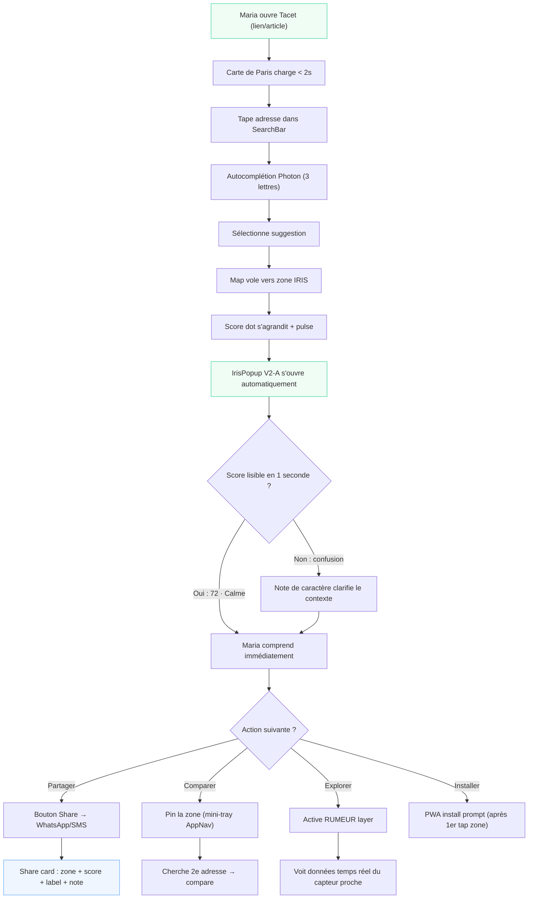
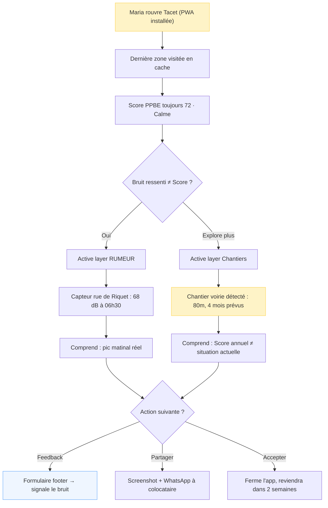
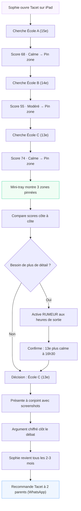
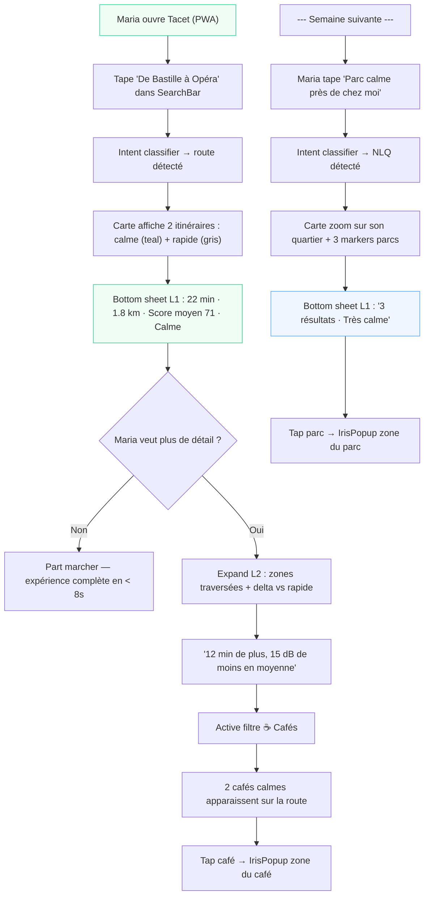

# UX Design Specification Tacet

**Author:** IVAN
**Date:** 2026-02-28

---

<!-- UX design content will be appended sequentially through collaborative workflow steps -->

## Executive Summary

### Project Vision

Tacet V2 is the first B2C urban companion making Paris's acoustic data beautiful, readable, and actionable. The core UX premise: same Bruitparif data as institutional portals, opposite emotional register. Where AirParif creates anxiety through density and technical framing, Tacet creates serenity through progressive disclosure, positive scoring, and a calm-first visual language.

V1 established the foundation: dark glass-morphism UI, teal brand identity (#0D9488), 4-tier noise choropleth (green/amber/red/violet), IrisPopup with score + day/night dB + share. V2 is a clean-slate redesign opportunity — extending and refining V1 patterns rather than starting from zero. The IrisPopup evolves from a flat information panel (V1) to a **layered answer surface** (V2) with a 3-layer visibility model (L1 answer / L2 context / L3 depth) — architecturally ready for V3 ambient agentic context-awareness.

**Governing design philosophy — Ambient Agentic (V3 trajectory):**
Tacet's UX evolves across versions toward two principles that shape every architectural decision:
1. **Minimalism of information** — not "less data available" but less data competing for attention at any moment. The system shows one clear answer; everything else exists only when pulled.
2. **Right-time disclosure** — the system uses context (time of day, user history, pinned zones, input intent) to surface the right information without being asked. This is what distinguishes ambient agentic from simple progressive disclosure: the system decides what's relevant, not the user.

V2 implements the structural foundation (L1/L2/L3 layers, polymorphic bottom sheet, intent-classifiable SearchBar). V3 activates the intelligence (context-aware visibility rules, intent detection, calm routing). V4 completes the vision (NLQ, the SearchBar becomes a conversational surface). Every V2 component is built to accept V3 context — even if V2 ignores it.

**Strategic deadline**: Q2 2026, before Paris municipal elections where urban noise is an explicit campaign issue. Tacet is the only consumer product making this data beautiful. The UX must be good enough to be shared organically before the media window opens.

### Target Users

**Maria, 36 — La Future Habitante (primary)**
- Apartment hunter in active search, high-intent, one-time decision context
- Core job: "Is this neighborhood calm enough to sign a 3-year lease?"
- Success: answers confidently in < 5 minutes, without acoustic expertise
- Key moment: taps zone → reads Score → compares 2 addresses → screenshots and WhatsApp-shares
- Device: mobile (primary), converts to PWA install
- Tech-savviness: moderate, non-technical

**Sophie, 42 — La Mère Attentive (secondary)**
- Parent monitoring school routes and neighborhood environments for children
- Recurring user (every 2–3 months), high organic advocacy rate
- Uses mobile + tablet (iPad)
- Key behavior: compares 3+ zones per session, shares to parent WhatsApp groups

### Key Design Challenges

1. **Score legibility without explanation** — The Score Sérénité (0–100) combined with the 5-tier label system ("Très calme / Calme / Modéré / Bruyant / Très bruyant") must be instantly comprehensible without any onboarding. Color, number, and label must cohere as one unified signal. V1 uses 4 tiers; V2 adds "Très calme" as a fifth tier for high-serenity zones.

2. **Data layer trust and clarity** — Three data types coexist on the map: PPBE annual (slow, authoritative), RUMEUR real-time (fast, sensor-based), Chantiers events (dynamic). Users must understand at a glance which data they are reading, when it was last updated, and whether it reflects current conditions — without a manual or tooltip sequence.

3. **Map + RGAA accessibility (≥ 95)** — Full-screen WebGL canvas (MapLibre) requires a complete keyboard-navigable text alternative per RGAA requirements. This must be designed as a first-class screen, not an afterthought, and must not degrade the primary visual experience.

4. **Mobile screen real estate** — SearchBar, layer toggles, IrisPopup, RUMEUR indicators, legend, PWA install prompt, and AppNav all compete on a 375px mobile screen. The interaction model must enforce strict hierarchy: one primary action surface visible at a time.

5. **Expert mode toggle** — Dual display mode (label tier for casual users / precise dB numbers for power users) needs a clear UI home that rewards depth without confusing Maria.

### Design Opportunities

1. **Calm-first visual language (clean slate)** — V2 is a visual redesign opportunity. The dark glass-morphism of V1 is a solid foundation. V2 can evolve toward warmer tones, more generous white space, and softer gradients — defining what "environmental data that feels like a premium travel companion" looks like, not what an institutional monitoring dashboard looks like.

2. **Zone character notes as editorial differentiator** — A pre-curated one-sentence "character note" per IRIS zone adds human warmth that no institutional portal has. Styled as editorial/italic, visually distinct from data fields. Example: *"Quartier animé du 11e — nuits festives autour d'Oberkampf, mais intérieurs d'îlots très préservés."* Implemented as static pre-generated copy to keep infrastructure cost at $0. *(Open decision: per-arrondissement for V2 / per-IRIS for V2.1; character-only vs. character + data caveat when relevant.)*

3. **Share payload as acquisition design** — Maria's WhatsApp screenshot is an explicit organic acquisition loop. The IrisPopup must be designed to produce a beautiful, legible screenshot: zone name, Score, label, and character note composing into a shareable visual card.

4. **Progressive disclosure architecture** — Score Sérénité as the single upfront answer; RUMEUR, Chantiers, expert dB values, noise factors, and character notes all accessible on demand. The default view serves Maria (one number, one label, one action). Power users and Sophie's multi-zone comparison mode are one tap deeper.

---

## Core User Experience

### Defining Experience

The core loop of Tacet is three steps:

> **Search address → Zone auto-highlights + IrisPopup auto-opens → Score Sérénité reads immediately**

Everything else — layers, comparison, expert mode, character notes — is depth around this moment. Getting this 3-step path completely effortless, in under 5 seconds, is the singular design mandate for V2.

**The core action that must be perfect:** After typing an address and selecting a suggestion, the map flies to the zone and the IrisPopup opens automatically, with no additional tap required. Maria sees the Score the instant the map lands.

**Lightweight saved zones (V2 scope):** Users can pin up to 3 zones during a session for side-by-side comparison. This supports Sophie's multi-zone decision flow (3 schools, 3 neighborhoods) without requiring an account or persistent state.

### Platform Strategy

| Dimension | Decision |
|-----------|----------|
| Primary platform | Mobile PWA (375px, touch-first) |
| Secondary platform | Tablet (768px, iPad — Sophie's use case) |
| Desktop | Supported, not primary design target |
| Install | PWA (no app store) — install prompt after first zone tap |
| Offline | Serwist: last visited zone cached, offline banner shown |
| Accounts | None in V2 — zero signup friction |
| Layer controls | Inside bottom AppNav (existing pattern, no new surface) |

### Effortless Interactions

The following interactions must require **zero cognitive load** — they should feel like natural extensions of looking at the map:

1. **Address → Score in one gesture** — Search input + zone auto-open = no tap between "I found the address" and "I see the score"
2. **Score legibility** — The number, color, and label (e.g., "72 · Calme") must be readable in one glance with no acoustic expertise
3. **PWA install** — Triggered after first zone tap (first meaningful action = user has seen value, install feels earned not intrusive)
4. **Share** — Native share sheet, activated from the IrisPopup — no intermediate screen, no account required
5. **Zone pin (saved zones)** — Single tap to pin/unpin a zone; pinned zones accessible from a persistent mini-tray in the AppNav area

### Critical Success Moments

| Moment | User | What must happen |
|--------|------|-----------------|
| **Auto-reveal** | Maria | Taps address suggestion → map flies → panel opens → Score visible. Zero extra taps. |
| **Instant legibility** | Maria | Reads "72 · Calme" in 1 second with no prior knowledge of Lden or PPBE |
| **First comparison** | Sophie | Pins zone A, taps zone B — sees both scores in AppNav mini-tray, makes her decision |
| **PWA install** | Maria | Sees score on first zone tap → install prompt appears → taps "Ajouter à l'écran d'accueil" naturally |
| **Share moment** | Maria | Taps Share → WhatsApp preview shows score + zone name + label → friend opens link → they also discover Tacet |
| **Data trust** | Both | Layer type (PPBE / RUMEUR / Chantiers) and data freshness visible at a glance — no confusion about "is this up to date?" |

### Experience Principles

1. **Zero friction to insight** — Search → Score in one gesture, no intermediate screens, no acoustic expertise required. Time-to-insight target: < 5 seconds from address entry.

2. **One signal, one action** — At any moment the UI has one primary thing to read (the Score) and one primary thing to do (compare, share, or install). Secondary surfaces never compete with the primary one.

3. **Depth on demand** — Everything beyond the Score (RUMEUR, Chantiers, noise factors, expert dB, character notes, Baromètre) is accessible but never imposed. Maria's default path never touches any of these.

4. **Trust through transparency** — Data type (annual PPBE / real-time RUMEUR / event Chantiers), data vintage, and known limitations are always visible but presented calmly — as context, not as warnings.

5. **Designed to be shared** — Every state the app can produce must look beautiful as a screenshot. The IrisPopup layout is a shareable visual card first, an information panel second.

6. **Ambient agentic (V3 trajectory)** — The system surfaces the right information at the right time without being asked. V2 builds the structural layers (L1/L2/L3) and the polymorphic bottom sheet. V3 activates context-aware visibility and intent detection. The user never manipulates filters or modes — they ask, and the system responds with exactly what's relevant. Every V2 component accepts a `contextHints` prop, even if V2 ignores it.

---

## Desired Emotional Response

### Primary Emotional Goals

**Core emotional target: Calm confidence.**

Tacet must make users feel two things simultaneously:
- **Calm** — the data does not alarm, overwhelm, or create anxiety, even when a zone is noisy. The opposite of AirParif.
- **Confident** — the user feels equipped to act on what they just read. Not just informed, but empowered.

The product name itself — Tacet (musical silence) — sets the emotional register. Every design decision should ask: "Does this feel like silence, or does it add noise?"

**What would make Maria tell a friend:** *Surprise at how simple it was.* She expected a government portal. She got a calm, beautiful answer in 10 seconds. That gap — between expectation and reality — is the share trigger.

### Emotional Journey Mapping

| Stage | Emotion | Design goal |
|-------|---------|-------------|
| **Discovery** (article/share link) | Curiosity — *"Is this the tool that actually explains noise data?"* | First screen must deliver on the promise within 3 seconds |
| **Map loads** (Paris choropleth appears) | Orientation + mild wonder — *"It's like a noise weather map"* | Color gradient must feel calm, not alarming — even the "Bruyant" red should feel soft |
| **Score auto-reveals** (IrisPopup opens) | **Relief + clarity** — *"72 · Calme. I understand this."* | The score is the payoff — it must be the visual center of the panel |
| **Comparison** (pins zones) | Agency + confidence — *"I'm making a data-backed decision"* | Comparison tray must feel like a natural research tool, not a technical feature |
| **Task complete** (decides/shares) | **Relief + pride** — *"I found my answer. I can act."* | Share button placement and share card design amplify this moment |
| **Degraded state** (RUMEUR offline) | Informed acceptance — *"Real-time is unavailable, but I still have the annual data"* | Error/fallback states must be calm, not alarming — context not warnings |
| **Return visit** (Sophie, week 2) | Familiarity + trust — *"This is my noise companion. I know how to read it."* | Consistent UI — no surprises on return, interface feels like a reliable tool |

### Micro-Emotions

The following micro-emotional pairs define the design guardrails — Tacet must always land on the left side:

| Design for ✅ | Avoid ❌ |
|---|---|
| **Confidence** when reading the Score | Confusion about what the number means |
| **Trust** in data quality and limitations | Skepticism — "Is this real? Is it up to date?" |
| **Calm** when seeing a noisy zone | Anxiety — "My neighborhood is dangerous" |
| **Delight** at the character note | Mere satisfaction — the editorial warmth should surprise |
| **Agency** when comparing zones | Overwhelm — too many data points at once |
| **Clarity** about data type (PPBE vs RUMEUR) | Confusion about which data is being displayed |

### Design Implications

| Emotional goal | UX / visual design approach |
|---|---|
| **Calm** | Warm palette evolution from V1 teal. Soft gradients on choropleth — even "Très bruyant" violet should not feel alarming. No red-alert UI metaphors, no warning triangles. Score displayed as serenity (higher = better), never as noise level (higher = worse). |
| **Confidence** | Score Sérénité as the unambiguous top-line signal — large number, clear label, clear color. Never compete with raw dB on first view. One primary signal. |
| **Trust** | Data provenance (Bruitparif, année 2024) always visible but in muted, small typography — footer-level, never banner-level. RUMEUR timestamp shown as a confidence indicator, not a freshness warning. |
| **Delight** | Character note styled in italic, slightly muted tone — an editorial whisper, not a data field. Beautiful share card layout that looks intentionally designed. "Très calme" tier as an aspirational reward. |
| **Agency** | Zone comparison tray feels like a research notebook — pinning a zone is a natural gesture, not a settings action. Expert mode toggle is discoverable but non-intrusive. |

### Emotional Design Principles

1. **Serenity is the product** — Not the map. Not the data. The emotional experience of finally understanding your acoustic environment without anxiety. Every pixel should serve this.

2. **The score is the answer** — Maria doesn't want to understand acoustics. She wants to know if she can sleep. The Score Sérénité delivers that answer, and the rest of the UI must support rather than compete with it.

3. **Calm degradation** — When things go wrong (RUMEUR down, offline mode, data stale), the response is calm context, not alarming error states. Users should feel informed, not abandoned.

4. **Earned delight** — Surprise and delight come from the character notes and the share card quality — both reveal that Tacet was built with care. This is not a government portal.

5. **Trust through restraint** — We show less than we could. Every data field we don't show by default is a decision to protect the user's emotional state. Depth is always one tap away; it is never the default view.

---

## UX Pattern Analysis & Inspiration

### Inspiring Products Analysis

**1. Citymapper — Information clarity model**
Translates complex multi-modal transit data into one instantly readable answer per query ("Your bus in 4 min"). The map is context; the panel is the answer. Ruthless information hierarchy — nothing competes with the primary response. Users never need to interpret raw data.
*Tacet takeaway:* Score Sérénité IS Tacet's "4 min." The IrisPopup is the answer surface. The map is context, not the product.

**2. Apple Weather — Technical-to-human translation**
"Feels like 12°C" removes the expertise barrier entirely (no one needs to understand barometric pressure). Layered architecture: summary → hourly → 10-day → radar. Each layer adds depth without imposing it on the default view.
*Tacet takeaway:* "Score 72 · Calme" = "feels like 12°." Expert mode (raw dB) = the hourly detail tap. The abstraction IS the product.

**3. Airbnb — Premium aesthetic on a data-heavy product**
Editorial neighborhood descriptions that add human warmth to data-driven content. Listing cards designed to produce beautiful screenshots — the shareable artifact is a first-class design concern. Bottom sheet over map on mobile. Premium feel that doesn't sacrifice information density.
*Tacet takeaway:* Character notes = neighborhood descriptions. IrisPopup layout = shareable listing card. Bottom sheet over map = established pattern Maria already trusts.

**4. Google Maps place card — Familiar zero-tap mobile pattern**
Tap a place → bottom sheet slides up immediately with name, rating, category, actions. Zero additional tap between "I see it on the map" and "I have the information." Saved places tray in nav. One-tap share.
*Tacet takeaway:* IrisPopup auto-reveal = place card slide-up. Score = rating. Zone pin = saved place. Maria already knows this interaction model.

### Transferable UX Patterns

| Pattern | From | Application in Tacet |
|---|---|---|
| **Single proxy metric as top-line signal** | Citymapper, Weather | Score Sérénité 0–100 before any raw dB |
| **Bottom sheet / card slide-up on map tap** | Google Maps, Airbnb | IrisPopup auto-reveal after address search |
| **Progressive disclosure: summary → detail** | Apple Weather | Score → day/night → noise factors → expert dB |
| **Shareable card as primary design constraint** | Airbnb | IrisPopup layout designed to screenshot beautifully |
| **Editorial neighborhood voice** | Airbnb | Character notes — italic, editorial, distinct from data fields |
| **Persistent saved items tray in nav** | Google Maps | Zone comparison mini-tray in AppNav |
| **Layer toggle as secondary surface** | Citymapper | AppNav layer controls — never interrupting the map |

### Anti-Patterns to Avoid

| Anti-pattern | Source | Why to avoid |
|---|---|---|
| **Raw data as primary display** | AirParif, Bruitparif portals | Requires acoustic expertise; creates anxiety |
| **Warning-colored UI for noisy data** | Environmental monitoring dashboards | Triggers alarm response; opposite of emotional goal |
| **Map overcluttered with pins/markers** | Early map aggregators | Visual noise; destroys the calm choropleth effect |
| **Multi-step share flow** | Many apps | Kills Maria's WhatsApp moment; share must be one tap |
| **Data tables without proxy abstraction** | SeLoger, PAP, PPBE portals | Requires expertise; no human-readable signal |
| **Windy-style data density** | Windy.com | Visually impressive but overwhelming; defeats calm-first goal |
| **Feature-driven navigation** | Enterprise dashboards | Users accomplish goals, not browse features |

### Design Inspiration Strategy

**Adopt directly:**
- Bottom sheet card slide-up on map interaction (universal pattern, Maria already knows it)
- Single proxy metric as unambiguous top-line signal
- Shareable card composition as a primary design constraint alongside information display

**Adapt for Tacet:**
- Airbnb editorial voice → character notes that are shorter and more data-contextualized (honest neighborhood whisper, not marketing copy)
- Weather progressive disclosure → Score → day/night indicators → noise source factors → expert dB behind a toggle
- Google Maps "Save place" → Session-only zone pin in V2 (sessionStorage, no account)

**Deliberately reject:**
- Any alarm/warning metaphor from environmental monitoring tools, even for high-noise zones
- Data before proxy — raw dB must never appear before the Score Sérénité
- Onboarding flows — the interface must be self-explanatory from first interaction

---

## Design System Foundation

### Design System Choice

**shadcn/ui + Tailwind CSS** — Tacet V2 will use shadcn/ui as its component foundation, built on Radix UI primitives and Tailwind CSS utilities.

shadcn/ui components are code-owned: installed directly into the project (not imported from a package), which means full control over every component's visual behavior — critical for V2's calm-first aesthetic evolution from V1's glass-morphism.

### Rationale for Selection

- **Already in project** — V1 uses Tailwind CSS (confirmed in `tacet/tailwind.config.ts`). shadcn/ui is the natural extension, not a migration.
- **RGAA compliance** — Radix UI primitives (the foundation of shadcn/ui) are built with WCAG 2.1 AA / ARIA compliance by default. This directly supports the RGAA ≥ 95 requirement without custom accessibility work on standard components.
- **Code ownership** — Components live in `/components/ui/`, fully editable. The glass-morphism patterns from V1 (`backdrop-blur-xl`, `bg-black/65`, `border-white/15`) can be preserved or evolved without fighting an opaque library.
- **Solo dev velocity** — shadcn/ui's "add what you need" model keeps the bundle lean. For a solo developer targeting Q2 2026, this is faster than a full design system adoption and more consistent than pure Tailwind ad-hoc styling.
- **Theming via CSS variables** — Tacet's design token layer (Score tiers, brand teal, glass-morphism tokens) maps cleanly onto shadcn/ui's CSS variable system.

### Implementation Approach

shadcn/ui handles **non-map UI** only. The MapLibre GL JS canvas, choropleth layers, and zone interaction remain custom-coded using MapLibre's API — shadcn/ui is not involved in the map rendering pipeline.

Component scope:
- **SearchBar** — shadcn/ui `Command` or `Combobox` pattern for address autocomplete
- **IrisPopup** — Custom component, styled with Tailwind + Tacet tokens; shadcn/ui `Badge` for tier label, `Separator` for section dividers
- **AppNav** — Custom floating nav, shadcn/ui `Toggle` for layer switches, `Button` for actions
- **OfflineBanner** — shadcn/ui `Alert` variant (calm, not alarming)
- **PWA install prompt** — shadcn/ui `Dialog` or custom bottom sheet
- **Zone comparison mini-tray** — Custom, sessionStorage-backed

### Customization Strategy

A Tacet design token layer sits on top of shadcn/ui defaults, defined in `globals.css` as CSS custom properties:

**Color tokens (5-tier Score Sérénité):**
- `--score-tres-calme`: `#4ade80` (green — V1 preserved)
- `--score-calme`: `#86efac` (soft green — new V2 tier color)
- `--score-modere`: `#fbbf24` (amber — V1 preserved)
- `--score-bruyant`: `#f87171` (red — V1 preserved)
- `--score-tres-bruyant`: `#c084fc` (violet — V1 preserved)

**Brand tokens:**
- `--brand-teal`: `#0D9488` (V1 identity, preserved)
- `--glass-bg`: `rgb(0 0 0 / 0.65)` + `backdrop-blur: 24px`
- `--glass-border`: `rgb(255 255 255 / 0.15)`

**Typography:**
- Font: Inter (V1 preserved, loaded via `next/font`)
- Score number: `text-4xl font-bold` (large, unambiguous)
- Tier label: `text-sm font-medium uppercase tracking-wide`
- Character note: `text-sm italic text-muted-foreground`
- Data provenance: `text-xs text-muted-foreground` (footer-level)

---

## Defining Experience — Interaction Mechanics

### Defining Experience Statement

> **V2: "Type any Paris address — your neighborhood's acoustic serenity appears in seconds."**
> **V3: "Ask anything about noise in Paris — the right answer appears."**

V2's defining moment is address → score in one gesture. Like Tinder's swipe or Citymapper's "4 min," the entire product promise is fulfilled in a single input. There is no second step between "I want to know" and "I know."

V3's defining moment extends this: the SearchBar accepts not just addresses but intents — routes, explorations, questions. The answer surface (bottom sheet) adapts to the intent. The user never changes mode, never navigates to a different screen, never learns a new interaction pattern. They ask → they get an answer → they go deeper if they want. Same gesture, broader vocabulary.

The product is not the map. It is not the data. It is this moment of instant, legible, calm clarity — delivered to someone who just wants to know if they can sleep, which route is quieter, or where to find a calm café.

### User Mental Model

Maria approaches Tacet like **Google Maps + a restaurant rating badge**. Her mental model:

- *"I type my address"* — she expects a search box to be the first thing she sees
- *"The map goes there"* — she expects the map to fly to her address
- *"I see a score"* — she expects a rating to appear immediately, like a star rating on a place card

**What she does NOT know and should never need to know:**
- What an IRIS zone is (she sees a highlighted area — she reads it as "my neighborhood")
- What Lden means (she sees "72 · Calme" — she reads it as "quiet enough")
- What PPBE stands for (she sees "Données Bruitparif 2024" — she reads it as "official, recent")
- That a WebGL tile is rendering behind the glass panel

**The starting state aligns with this model:** The map loads centered on Paris with the choropleth already visible, but the SearchBar is visually foregrounded. Maria sees a beautiful map and an obvious input — same as Google Maps. She knows exactly what to do. No onboarding. No tutorial. The interface is self-teaching.

### Success Criteria

The address-to-score experience is **successful** when:

| Criterion | Target |
|---|---|
| Time from address entry to Score visible | **< 5 seconds** |
| Additional taps required after selecting suggestion | **0** |
| Time to read and understand the Score | **< 1 second** |
| Acoustic expertise required to interpret result | **None** |
| User action to see Score via direct map tap | **1 tap** (same as search path) |
| Expert mode encounters by Maria (default flow) | **0** |

**Failure signals** — any of the following indicate the experience broke:
- User re-reads the Score label more than once
- User asks "but what does this mean in practice?"
- User taps elsewhere trying to get more information before reading the Score
- User expects to see raw dB numbers before the Score

### Novel vs. Established Patterns

**Established patterns adopted as-is:**
- Search autocomplete → map fly-to (Google Maps, Citymapper — universal familiarity)
- Bottom sheet panel over map (Google Maps place card — Maria already knows this)
- Score/rating as primary signal, color-coded (Yelp, Airbnb, Google Maps ratings)
- Zone tap → info panel (Google Maps — tap a place, card slides up)

**Novel patterns requiring intentional design:**

| Novel pattern | What makes it different | Design implication |
|---|---|---|
| **Auto-reveal without second tap** | Google Maps requires tap on pin after fly-to; Tacet eliminates this step | Panel must slide in smoothly — cannot feel "forced" or intrusive |
| **Zone as interaction unit, not pin** | User taps the colored area, not a marker | Zone highlight (polygon glow) must clearly signal "this is selected" |
| **Serenity-direction scoring** | Higher = calmer (opposite of "noise level" intuition) | Label always accompanies number; "72 · Calme" not "72 dB" |
| **Expert mode in Settings** | Expert dB values hidden by default, not behind an inline toggle | Power users who want raw numbers find them in Settings; casual users never encounter the option |

### Experience Mechanics

**The address-to-score flow — full breakdown:**

#### Initiation

1. User arrives at Tacet (shared link, organic search, or PWA launch)
2. Map loads: Paris choropleth visible — 5-tier color landscape, no markers, clean and readable
3. SearchBar is visually foregrounded — positioned top-center, placeholder: *"Rechercher une adresse à Paris…"*
4. User taps SearchBar → keyboard opens, input is active

#### Interaction

5. User types 2+ characters → debounced geocoding fires (350ms delay), Paris-bounded
6. Up to 5 address suggestions appear in a dropdown — street name + arrondissement
7. User taps suggestion → SearchBar collapses, map animation begins immediately
8. Map flies to zone — 1200ms ease-in-out animation, zone polygon highlights (soft border glow)
9. IrisPopup slides up from bottom — 300ms ease — **without any additional tap**
10. Score Sérénité is the first visual element: large number (`text-4xl`), tier color, tier label

**Alternative path — direct map tap:**
- User taps any point on the choropleth → zone detects tap → **same IrisPopup auto-reveal** (steps 9–10)
- Behavior is identical regardless of entry path: search or tap, the panel always auto-opens

#### Feedback

- **Zone highlight** — polygon border glows in the tier color, confirming "this is the zone"
- **Color coherence** — IrisPopup accent color matches the choropleth color of the tapped zone (visual confirmation)
- **Score + progress bar** — dual signal: number is precise, bar is analogical — both point to the same answer
- **Tier label** — *"72 · Calme"* — two independent signals confirming one answer; no ambiguity

#### Completion

- Maria has her answer: **L1 only** — Score + tier label + SerenityBar. That's the entire default surface. No scrolling required, no cognitive load beyond the answer.
- **Immediate actions available inline (L1) :**
  - 📤 Share → native share sheet, one tap, no account required
  - 📍 Pin → save zone to comparison mini-tray (up to 3 zones, session-only)
- **PWA install prompt** — appears after first zone interaction if not yet installed (earned, not intrusive)
- **Depth on demand (L2 → L3) :** A subtle chevron `▾` below SerenityBar signals expandability. One tap reveals L2 (character note, contextual dB, comparison delta). A second scroll-or-tap reveals L3 (full dB data, sources, provenance, methodology). The popup never auto-expands in V2 — Maria controls the depth. V3 ambient rules may auto-surface L2 elements based on context (see IrisPopup component spec).

---

## Visual Design Foundation

### Design Philosophy

V2 moves from dark glass-morphism (V1) to a **warm light-first aesthetic** — the visual register of a premium hospitality or travel companion app, not an environmental monitoring dashboard. Dark mode is a first-class variant that expresses the same warmth on deep backgrounds.

The teal brand identity (`#0D9488`) is preserved — it reads beautifully as an accent on warm light backgrounds, even more legibly than on dark.

### Color System

#### Background & Surface Palette

| Token | Light Mode | Dark Mode | Role |
|---|---|---|---|
| `--bg-canvas` | `#FAFAF7` | `#0C0A09` | App background — warm off-white / warm charcoal |
| `--bg-surface` | `#FFFFFF` | `rgba(255,255,255,0.08)` | Panels, cards (IrisPopup, SearchBar) |
| `--bg-surface-elevated` | `#F5F3EF` | `rgba(255,255,255,0.12)` | Secondary surfaces, tooltips |
| `--border-subtle` | `rgba(0,0,0,0.08)` | `rgba(255,255,255,0.12)` | Panel borders |

Dark mode glass panels: `backdrop-blur-24px` preserved — the blur is expressive, not merely decorative.

#### Brand & Semantic Colors

| Token | Light | Dark | Usage |
|---|---|---|---|
| `--brand-teal` | `#0D9488` | `#0D9488` | Primary actions, links, active states |
| `--brand-teal-light` | `#CCFBF1` | `#042f2e` | Teal tint backgrounds, hover states |
| `--text-primary` | `#1C1917` | `#F5F5F4` | Main text (stone-900 / stone-100) |
| `--text-secondary` | `#78716C` | `#A8A29E` | Metadata, labels (stone-500 / stone-400) |
| `--text-muted` | `#A8A29E` | `#78716C` | Data provenance, footnotes |

#### Score Sérénité — 5-Tier Color System (V2 Redesign)

The V1 saturated palette was calibrated for dark glass-morphism. V2 uses softer, more ambient tier colors suited to warm light backgrounds. **"Très calme" is redesigned as a distinctive aspirational color tied to the brand teal family.**

| Tier | Label | Fill Color | Text Variant | Hex (fill) | Hex (text) |
|---|---|---|---|---|---|
| 1 | **Très calme** | Teal-sky | Cyan-700 | `#2DD4BF` | `#0E7490` |
| 2 | **Calme** | Sage | Emerald-600 | `#6EE7B7` | `#059669` |
| 3 | **Modéré** | Warm amber | Amber-700 | `#FCD34D` | `#B45309` |
| 4 | **Bruyant** | Soft terracotta | Red-600 | `#FCA5A5` | `#DC2626` |
| 5 | **Très bruyant** | Soft mauve | Purple-600 | `#D8B4FE` | `#7C3AED` |

- **Fill colors**: Used for choropleth fills, background badges, progress bar
- **Text variants**: Used for tier label text and score number (darkened for WCAG 4.5:1 contrast on white)
- Choropleth fill opacity: `0.65` on light base map / `0.75` on dark base map

**"Très calme" as a brand moment:** The teal-400 (`#2DD4BF`) ties directly to brand teal (`#0D9488` = teal-600). When Maria sees a "Très calme" zone, the panel accent, tier badge, and brand color all resonate together — the serenity of the app and the serenity of the zone feel unified.

#### Light / Dark Mode Strategy

- **Default:** Light mode
- **First load:** Respect `prefers-color-scheme` (system dark → dark mode launched; system light → light mode launched)
- **Override:** Manual toggle in Settings, persisted in `localStorage`
- **No auto-switching** mid-session — cognitive consistency over ambient adaptation

### Typography System

Font: **Inter** (preserved from V1, via `next/font/google`). Single typeface, differentiated by weight, size, and tracking.

| Element | Style | Notes |
|---|---|---|
| Zone name (IrisPopup header) | `text-xl font-semibold tracking-tight` | stone-900 / stone-100 |
| **Score number** | **`text-5xl font-bold`** | Tier text color — visual center of the panel |
| Tier label | `text-xs font-semibold tracking-widest uppercase` | Tier text color — always paired with score |
| Arrondissement / subheader | `text-sm` + `--text-secondary` | Contextual metadata |
| Character note | `text-sm italic` + `--text-secondary` | Editorial whisper — not a data field |
| Day/night dB values | `text-sm font-medium` | stone-700 / stone-300 |
| Data provenance | `text-xs` + `--text-muted` | Footer-level, never banner-level |
| AppNav labels | `text-[10px] font-medium tracking-wide uppercase` | Below icons |
| SearchBar placeholder | `text-sm` + `--text-muted` | *"Rechercher une adresse à Paris…"* |

**Score at `text-5xl` (48px):** The score must be the largest element in the panel by a significant margin. At 48px on a 375px mobile screen, it reads at arm's length, instantly, without glasses.

### Spacing & Layout Foundation

**Base unit:** 4px grid. All spacing values are multiples of 4.

#### Panel Geometry (IrisPopup)
- Padding: `p-5` (20px) — generous, premium feel
- Corner radius: `rounded-2xl` (16px) for panels; `rounded-full` for tier badges
- Shadow (light): `shadow-lg shadow-stone-900/8` — warm, soft
- Shadow (dark): none — glass border defines the edge
- Max width: `max-w-sm` (384px) on mobile, centered

#### Mobile Layout Anchors (375px)
- SearchBar: `top-4 left-4 right-4` — full-width with 16px gutters
- IrisPopup: `bottom-0 left-0 right-0`, slides up, `rounded-t-2xl` only
- AppNav: `bottom-4 left-4 right-4` — floating, below SearchBar in z-order

#### Z-index Hierarchy
| Layer | Z-index |
|---|---|
| SearchBar | `z-40` |
| IrisPopup | `z-30` |
| AppNav + Legend | `z-20` |
| Map canvas | `z-10` |

#### Internal Panel Spacing
- Between score and tier label: `gap-1` (4px) — reads as one unit
- Between tier label and character note: `gap-3` (12px) — clear visual breathing room
- Between character note and day/night block: `gap-4` (16px)
- Section dividers: `my-3` (12px)

### Accessibility Considerations

**Target: RGAA Lighthouse score ≥ 95**

#### Contrast Ratios (WCAG 2.1 AA)

| Element | Foreground | Background | Required | Note |
|---|---|---|---|---|
| Score number (≥ 24px large text) | Tier text color | `#FFFFFF` | 3:1 | Darkened text variants ensure compliance |
| Tier label (small text) | Tier text color | `#FFFFFF` | 4.5:1 | Text variant (not fill) used for labels |
| Body text | `#1C1917` | `#FFFFFF` | 4.5:1 | ✅ ≈ 17:1 |
| Secondary text | `#78716C` | `#FFFFFF` | 4.5:1 | ✅ ≈ 5.3:1 |
| Brand teal on white | `#0D9488` | `#FFFFFF` | 4.5:1 | ✅ ≈ 4.6:1 (meets AA) |

#### Map Accessibility (RGAA-specific)
Full-screen WebGL canvas requires a complete **text-alternative view** — a keyboard-navigable zone table with scores, designed as a first-class screen, not a hidden fallback.

#### Focus & Interaction Accessibility
- SearchBar: autofocuses on desktop load
- IrisPopup: focus trap when open (keyboard navigation)
- AppNav: all icon-only buttons carry `aria-label`
- Map element: `aria-label="Carte acoustique de Paris"` + keyboard shortcut to text alternative

## Design Direction Decision

### Design Directions Explored

Four rounds of visual exploration:
- Round 1: 6 directions (Minimaliste, Flottant, Premium, Sombre, Expert, Circulaire)
- Round 2: 3 refined floating-card variants + "Très calme" color candidates
- Round 3: Map rendering — SVG blur-filtered zone halos (Plume Labs inspired)
- Round 4: Score dots + ambient glow (IQAir × Airbnb hybrid) — polygons fully removed

### Chosen Direction

**"Le Flottant Élégant" (V2-A)** — popup confirmed.
**"Score Dots + Ambient Glow"** — map visualization confirmed.

#### Popup: Le Flottant Élégant
Floating glass panel (~88% width) over the map. Score (`text-5xl font-bold`) dominant. Tier label only — no raw dB in default view. Note de caractère in italic below score. Thin serenity progress bar. Map visible above panel at all times. Frosted glass in light mode; maximum transparency in dark mode.

#### Map: Score Dots + Ambient Glow
IRIS zone data represented as small tier-colored circular markers (score dots) at zone centroids. Map stays 100% clean and navigable. Progressive zoom disclosure:
- City zoom (10–12): arrondissement-level clustered dots
- Neighborhood zoom (13–16): individual IRIS dots at tier color
- Street zoom (17+): dots persist, map detail is the star

Optional ambient glow layer (default OFF): subtle radial gradients around each dot creating an atmospheric color wash. Toggled via AppNav settings.

Selected zone: dot scales up + subtle dashed IRIS boundary at ~30% opacity. Zero fill or 3% max.

**Updated tier colors (V2 final):**
- Très calme: `#34D399` fill / `#065F46` text (warm emerald)
- Calme: `#6EE7B7` fill / `#059669` text
- Modéré: `#FCD34D` fill / `#B45309` text
- Bruyant: `#FCA5A5` fill / `#DC2626` text
- Très bruyant: `#D8B4FE` fill / `#7C3AED` text

### Design Rationale

1. **Map as hero** — No colored shapes obscure the city. The user can orient, project, and navigate freely. Streets, landmarks, Seine, parks — all fully visible. This is the premium hospitality feel.
2. **Score dots = precise data** — Each dot represents exactly one IRIS zone's score. No interpolation, no false gradients. The data is honest and clear.
3. **Progressive zoom disclosure** — City view shows the big picture (arrondissement clusters). Neighborhood view shows granularity. Street view keeps the map clean. Matches how people naturally explore.
4. **Future-ready** — Score dots (static IRIS data) and future social sentiment markers (pulsing user reports) coexist naturally as separate visual layers. The ambient glow layer can incorporate both data sources.
5. **IQAir × Airbnb pattern** — Proven at scale. Users already understand "colored dot on map = tap to see details." Zero learning curve.

### Implementation Approach

- Score dots: MapLibre `circle` layer, source = IRIS zone centroid GeoJSON
- Clustering: MapLibre native cluster support at zoom < 13
- Ambient glow: MapLibre `circle` layer with large radius + low opacity, toggled via layout `visibility`
- Selected zone: MapLibre `line` layer (dashed) + `fill` layer (3% opacity) for the IRIS polygon boundary
- IrisPopup: absolutely-positioned `<div>`, `bottom-4 left-1/2 -translate-x-1/2 w-[88%]`
- Light glass: `bg-white/80 backdrop-blur-xl border border-white/50 shadow-lg rounded-2xl`
- Dark glass: `bg-white/6 backdrop-blur-[24px] border border-white/10 rounded-2xl`

## User Journey Flows

### Journey 1 — Maria: Découverte & Score

Maria découvre Tacet via un article ou un lien partagé. Elle cherche une adresse précise et doit obtenir un Score Sérénité en < 5 secondes sans expertise acoustique.

**Parcours détaillé :**



**Chemins d'erreur :**
- Adresse introuvable → Message calme "Adresse non trouvée, essayez un format différent" + suggestions
- Zone IRIS sans données → Score affiché "—" + explication "Données indisponibles pour cette zone"
- Réseau lent → Skeleton loader sur le popup, carte en cache PWA

### Journey 2 — Maria: Monitoring & Cas Limites

Maria revient 6 semaines après avoir signé son bail. Bruit inhabituel le matin. Elle rouvre Tacet pour comprendre.

**Parcours détaillé :**



**Signaux de confiance données :**
- Vintage PPBE visible : "Données annuelles 2024 (Bruitparif)" en `text-xs text-muted-foreground`
- Timestamp RUMEUR : "Mis à jour il y a 12 min" comme indicateur de fraîcheur
- Layer Chantiers : source Open Data Paris, dates début/fin affichées
- Distinction visuelle claire entre Score statique (PPBE) et données dynamiques (RUMEUR/Chantiers)

### Journey 3 — Sophie: Comparaison Multi-Zones

Sophie compare 3 écoles dans des arrondissements différents. Elle utilise son iPad, revient régulièrement, et partage ses découvertes.

**Parcours détaillé :**



**Différences Sophie vs Maria :**

| Dimension | Maria | Sophie |
|-----------|-------|--------|
| Fréquence | Usage unique (décision bail) | Récurrent (monitoring 2-3 mois) |
| Device | Mobile (375px) | Tablette iPad (768px) |
| Zones | 1-2 zones | 3+ zones en parallèle |
| Partage | WhatsApp à colocataire (1:1) | Groupe WhatsApp parents (1:N) |
| Layers | Score + RUMEUR | Score + RUMEUR + Chantiers |
| Décision | Personnelle (signer le bail) | Familiale (choix école + conjoint) |

### Journey 4 — Maria V3: Route Calme & NLQ (architecture-ready)

**Statut :** Hors scope V2. Ce parcours documente l'expérience cible V3 pour valider la cohérence architecturale des sections Route Flow et NLQ.

Maria a signé son bail (parcours V2 accompli). Elle utilise maintenant Tacet comme compagnon quotidien. Elle veut marcher au calme vers son nouveau bureau.

**Parcours détaillé :**



**Patterns V3 illustrés dans ce parcours :**
- **SearchBar intent detection** — même champ, input différent, réponse adaptée
- **Bottom sheet polymorphe** — Route summary card remplace l'IrisPopup, même position, même L1/L2/L3
- **Thematic filter chips** — apparaissent uniquement quand l'intent est `route`
- **NLQ → carte + résultats** — la requête en langage naturel produit des markers + une liste dans le bottom sheet
- **Transition route → IrisPopup** — taper un POI sur la route ouvre l'IrisPopup dans le même bottom sheet (content switch, pas navigation)

**Ce que V2 prépare :** L'architecture SearchBar (`onInputClassified`), le bottom sheet polymorphe (`BottomSheetContent` union type), et le layer registry MapLibre extensible rendent ce parcours implémentable sans refactoring.

### Journey Patterns

6 patterns réutilisables identifiés à travers les 4 parcours :

1. **Score-in-Seconds** — Recherche → vol carte → popup auto → score lisible en < 5s. Aucun tap intermédiaire entre sélection d'adresse et affichage du score. Ce pattern est le cœur de chaque parcours.

2. **Progressive Layer Activation** — Score PPBE comme baseline → RUMEUR pour le temps réel → Chantiers pour l'événementiel. Chaque couche s'active à la demande, jamais imposée. L'utilisateur descend en profondeur naturellement.

3. **Pin → Compare → Decide** — Pin d'une zone (1 tap) → pin d'une 2e/3e zone → mini-tray de comparaison. Maximum 3 zones en session (sessionStorage). Sophie utilise ce pattern systématiquement ; Maria l'utilise pour comparer 2 appartements.

4. **Calm Degradation** — Quand les données ne correspondent pas au vécu (Maria J2), le système offre des couches d'explication (RUMEUR, Chantiers) plutôt que des alertes. Le ton reste informatif, jamais alarmiste. "Les données sont transparentes, pas anxiogènes."

5. **Share as Acquisition** — Chaque moment de partage (WhatsApp, screenshot) est un canal d'acquisition organique. La share card est conçue comme un objet visuel autonome : zone + score + label + note de caractère. Chaque partage est une publicité gratuite.

6. **One Input, Adapted Answer (V3)** — La SearchBar est le seul point d'entrée quel que soit l'intent (adresse, route, NLQ). Le bottom sheet est la seule surface de réponse. Le contenu s'adapte à l'intent — le conteneur et le pattern (slide-up, L1/L2/L3, dismiss) restent identiques. L'utilisateur n'apprend qu'une seule interaction, applicable à tout.

### Flow Optimization Principles

1. **Zéro tap superflu** — De l'adresse au Score, aucune étape intermédiaire. Le popup s'ouvre automatiquement. Maria ne doit jamais chercher l'information — elle apparaît.

2. **Un signal primaire** — À tout moment, un seul chiffre domine visuellement (le Score). Les couches secondaires (RUMEUR, Chantiers, dB expert) sont accessibles mais ne rivalisent jamais avec le signal principal.

3. **Comparaison naturelle** — Le pin de zone est un geste aussi naturel que le favori Instagram. La mini-tray de comparaison est toujours visible dans l'AppNav. Comparer ne nécessite pas de mode spécial.

4. **Confiance par transparence douce** — Provenance (Bruitparif), vintage (2024), fraîcheur RUMEUR — toujours visibles en `text-xs`, jamais en bannière d'alerte. L'utilisateur sait d'où viennent les données sans être inquiété par leur ancienneté.

5. **Acquisition organique intégrée** — Le bouton Share est dans le popup principal (pas dans un menu). La share card est belle par design. Le lien partagé ouvre Tacet directement sur la zone concernée (deep link).

### Enrichissement Futur : PLU & Travaux

Opportunité identifiée : connecter les données PLU (Plan Local d'Urbanisme) et les travaux à venir de la Ville de Paris pour contextualiser la réponse acoustique. Exemples :
- Zone classée en "mutation urbaine" dans le PLU → avertissement que le profil sonore pourrait évoluer
- Travaux prévus à proximité (Open Data Paris) → indication temporelle ("chantier prévu Q3 2026")
- Permis de construire accordés → anticipation d'évolution du quartier

**Statut : hors scope V2, noté comme enrichissement V3 pour les layers contextuels.**

### V3 Architecture-Ready: Calm Route Flow

**Statut :** Hors scope V2. Cette section documente l'architecture UX pour que V2 ne bloque pas l'implémentation V3.

**But :** Permettre à l'utilisateur de naviguer d'un point A à un point B par les rues les plus calmes de Paris. Pas un GPS turn-by-turn — un **planificateur d'itinéraire serein** qui propose une route optimisée pour le calme, avec variantes thématiques optionnelles.

**Principe ambient agentic :** La route n'est pas une fonctionnalité séparée avec un écran dédié. C'est une **réponse** à une intention de déplacement, surfacée dans le même espace que toutes les autres réponses Tacet (la carte + un overlay). L'utilisateur ne "change pas de mode" — il pose une question différente au même endroit.

#### Entrée dans le flux route

Le point d'entrée est la **SearchBar** — le même champ que pour la recherche d'adresse. L'intent detection (V3) distingue :

| Input utilisateur | Intent détecté | Réponse |
|---|---|---|
| "12 rue de Rivoli" | Adresse → geocoding | IrisPopup (flux existant) |
| "De Bastille à République" | Route → A→B | Route overlay (nouveau) |
| "Balade calme depuis Marais" | Route → exploration | Route boucle (nouveau) |
| "Café calme près de République" | NLQ → recherche sémantique | Résultats POI (voir section NLQ) |

**V2 SearchBar :** Reste un geocoder pur. Aucun intent detection. Placeholder = *"Rechercher une adresse à Paris…"*

**V3 SearchBar :** Intent detection côté client (regex patterns simples : "de…à", "depuis", "vers", "balade", "itinéraire") OU côté serveur (LLM classification). Placeholder évolue vers *"Adresse, itinéraire, ou question…"*. L'architecture V2 doit prévoir un `onInputClassified(intent, payload)` callback même s'il ne retourne que `{ intent: 'address' }` en V2.

#### Anatomie de la réponse route

La route calme se superpose sur la carte exactement comme le choropleth — c'est un **layer**, pas un écran.

**Éléments visuels :**

| Élément | Description | Position |
|---|---|---|
| **Route line** | Polyline sur la carte, couleur teal brand (`#0D9488`), épaisseur 4px, avec halo blanc 8px pour lisibilité | Layer MapLibre, `z-index` au-dessus du choropleth |
| **Route summary card** | Remplace l'IrisPopup dans la même position bottom sheet | Bottom sheet (`z-30`) |
| **Waypoints** | Départ (cercle plein teal) + Arrivée (cercle plein teal avec coche) | Markers MapLibre |
| **Alternative routes** (optionnel) | 1-2 alternatives en gris semi-transparent, tapable pour switcher | Layer MapLibre, sous la route principale |

**Route summary card (bottom sheet) — anatomie :**

| Couche | Éléments |
|--------|----------|
| **L1 — Réponse** | Durée à pied (`text-3xl font-bold`), Distance, Score Sérénité moyen du trajet + TierBadge |
| **L2 — Contexte** | Zones IRIS traversées (liste compacte avec mini-scores), Comparaison vs. itinéraire le plus court ("12 min de plus, 15 dB de moins en moyenne"), Variante thématique active (si applicable) |
| **L3 — Profondeur** | Profil sonore du trajet (mini-graphe dB le long de la route), Sources de bruit traversées, DataProvenance |

**Même modèle L1/L2/L3 que l'IrisPopup.** Cohérence du pattern = zéro apprentissage supplémentaire.

#### Variantes thématiques

Routes enrichies par des POI le long du parcours calme :

| Thème | POI sources | Icône |
|---|---|---|
| 🌿 Nature | Parcs, squares, jardins (Open Data Paris) | Feuille |
| 🎨 Street Art | Belleville, Oberkampf, 13e (curation éditoriale) | Palette |
| ☕ Cafés calmes | Google Places API ou curation (V3+) | Tasse |
| 🍽️ Gastro | Marchés, restaurants (curation) | Fourchette |

**Interaction :** Filtres horizontaux scrollables sous la SearchBar quand un intent route est détecté. Un seul thème actif à la fois. Default = aucun thème (route calme pure).

#### Routing engine (architecture)

- **OSRM** ou **Valhalla** auto-hébergé ou API tierce
- **Pondération custom :** coût de traversée par rue = f(Lden de la zone IRIS traversée). Les rues dans les zones "Très calme" ont un coût faible ; les rues dans "Très bruyant" ont un coût élevé.
- **Fallback :** Si le routing engine est indisponible, proposer l'itinéraire le plus court classique avec le profil sonore des zones traversées (informatif, pas optimisé).

#### Ce que V2 prépare architecturalement

1. **SearchBar `onInputClassified` callback** — accepte un objet `{ intent: string, payload: any }`. V2 : toujours `{ intent: 'address' }`. V3 : enrichi.
2. **Bottom sheet comme pattern générique** — L'IrisPopup et le Route summary card partagent le même conteneur bottom sheet. Le contenu change, le pattern est identique.
3. **MapLibre layer architecture** — Le choropleth est un layer. Les ScoreDots sont un layer. La route sera un layer. L'architecture de layers doit être extensible (registre de layers dans un context/store).

---

### V3 Architecture-Ready: NLQ Input (Natural Language Query)

**Statut :** Hors scope V2, possiblement V4 selon le PRD. Cette section documente l'architecture UX pour que le SearchBar ne devienne pas un cul-de-sac architectural.

**But :** Permettre à l'utilisateur de poser une question en français naturel — "Trouve-moi un café calme en dessous de 55 dB près de République" — et recevoir une réponse structurée sur la carte.

**Principe ambient agentic :** Le NLQ est l'aboutissement de la philosophie ambient agentic. L'utilisateur ne manipule pas des filtres, des toggles, des couches — il **dit ce qu'il veut** et le système répond. La SearchBar est le seul point d'entrée. L'intent detection (route, adresse, NLQ) est transparente.

#### Spectre d'intelligence de la SearchBar

| Version | Capacité | Technologie |
|---------|----------|-------------|
| **V2** | Geocoding pur — adresses uniquement | Photon Komoot API, regex Paris-bounded |
| **V3** | Intent detection — adresse vs. route vs. exploration | Regex côté client + fallback LLM API |
| **V4** | NLQ complet — questions en langage naturel, filtres sémantiques, POI | LLM API (Claude/GPT) + structured output → requête carte |

**L'architecture V2 ne change pas pour NLQ.** Mais le `onInputClassified` callback et la séparation input/réponse permettent d'ajouter NLQ sans refactorer le SearchBar.

#### Anatomie d'une réponse NLQ

La requête NLQ produit un **résultat structuré** affiché sur la carte + dans le bottom sheet :

**Exemple :** "Café calme sous 55 dB près de République"

| Élément | Description |
|---|---|
| **Carte** | Zoom sur République, cercle de rayon de recherche (500m default), POI markers pour les cafés dans les zones ≤ 55 dB |
| **Bottom sheet L1** | "3 résultats · Calme" + liste compacte des POI (nom, distance, score zone) |
| **Bottom sheet L2** | Détail de chaque POI (adresse, score zone, note caractère zone, horaires si disponible) |
| **Bottom sheet L3** | Méthodologie du filtre, provenance données, limitations |

**Pattern :** C'est une **liste de résultats** dans le même bottom sheet que l'IrisPopup et le Route summary. Le conteneur est identique. Le contenu s'adapte à l'intent.

#### Intent classification pipeline (V3/V4)

```
User input → Intent classifier → Structured query → Data layer → Response formatter → Bottom sheet
```

| Étape | V2 | V3 | V4 |
|-------|-----|-----|-----|
| Input | SearchBar texte | SearchBar texte | SearchBar texte + voix (futur) |
| Classifier | Regex → `address` | Regex → `address` / `route` / `explore` | LLM → `address` / `route` / `nlq` / `explore` |
| Query | Photon geocoding | Photon + OSRM | Photon + OSRM + POI API + Tacet DB |
| Response | IrisPopup | IrisPopup / Route card | IrisPopup / Route card / Results list |
| Bottom sheet | IrisPopup only | IrisPopup / Route summary | IrisPopup / Route summary / NLQ results |

#### Ce que V2 prépare architecturalement

1. **SearchBar comme composant "dumb input"** — Le SearchBar capture du texte et le passe à un classifieur. En V2, le classifieur est trivial (tout → Photon geocoding). Mais la séparation est en place.
2. **Bottom sheet comme conteneur polymorphe** — Le bottom sheet accepte un `children` prop. IrisPopup est un enfant. Route summary sera un enfant. NLQ results sera un enfant. Le conteneur gère : position, glass, slide-up, dismiss, L1/L2/L3 expand pattern.
3. **Response type discriminator** — Un type union `BottomSheetContent = IrisPopupContent | RouteContent | NLQResultsContent` (ou équivalent). V2 : un seul variant. V3+ : extensible.

---

## Component Strategy

### Design System Components (shadcn/ui)

Composants disponibles directement depuis shadcn/ui, avec customisation minimale :

| Composant shadcn/ui | Usage Tacet | Customisation |
|---|---|---|
| `Command` / `Combobox` | **SearchBar** — input + intent classifier (V2: geocoding only, V3+: route/NLQ) | Style glass, placeholder, `onInputClassified` callback architecture |
| `Badge` | **TierBadge** — label de tier ("Calme", "Modéré"…) | Couleurs 5-tier custom, `rounded-full` |
| `Button` | Actions (Share, Pin, Install) | Variantes glass + icon-only pour AppNav |
| `Toggle` | Layer switches (RUMEUR, Chantiers, Ambient) | Couleur tier-aware |
| `Alert` | **OfflineBanner** — mode dégradé calme | Tons neutres, jamais alarmiste |
| `Dialog` | **PWAInstallPrompt** — prompt d'installation | Glass treatment, un seul CTA |
| `Separator` | Divisions internes IrisPopup | Fine, `border-subtle` |
| `Tooltip` | Info-bulles AppNav | Glass variant |

### Custom Components

#### IrisPopup

**But :** Donner la réponse acoustique d'une zone IRIS en < 1 seconde de lecture. Cœur de l'expérience Tacet. Le popup est un **surface de réponse contextuelle** — pas un panneau d'information statique.

**Principe directeur — Ambient Agentic :** Le popup affiche *une réponse*, pas *toutes les données*. Ce qui est visible par défaut change selon le contexte utilisateur. L'anatomie complète existe toujours dans le DOM ; seule la *visibilité par défaut* varie.

**Anatomie complète (3 couches de visibilité) :**

| Couche | Éléments | Visibilité V2 | Visibilité V3 (ambient) |
|--------|----------|---------------|------------------------|
| **L1 — Réponse** | Zone name + arrondissement (header), Score `text-5xl font-bold` en couleur tier, TierBadge (label tier), SerenityBar (barre 4px, couleur tier) | Toujours visible | Toujours visible |
| **L2 — Contexte** | Note de caractère (italic, `text-muted-foreground`), dB jour OU nuit (selon l'heure), Delta comparatif ("plus calme que [zone pinnée]") | Visible sur expand (tap chevron ou scroll) | Surfacé automatiquement par le contexte (voir règles ci-dessous) |
| **L3 — Profondeur** | dB jour ET nuit (les deux), Sources de bruit (facteurs), DataProvenance footer (`text-xs`), Lien méthodologie Score | Visible sur expand, sous L2 | Visible sur expand, sous L2 |

**Actions (toujours visibles, L1) :** Share + Pin — boutons glass, inline à droite du TierBadge

**Règles de visibilité contextuelle (V3 — architecture-ready, implémentation différée) :**

| Contexte détecté | L2 surfacé automatiquement | Signal utilisé |
|------------------|---------------------------|----------------|
| Heure actuelle 22h–7h | dB nuit (au lieu de jour) | `new Date().getHours()` |
| Heure actuelle 7h–22h | dB jour | `new Date().getHours()` |
| ≥ 1 zone pinnée | Delta comparatif vs. zone(s) pinnée(s) | `pinnedZones.length > 0` |
| ≥ 3ème visite même session | Note de caractère | `sessionStorage` visit count |
| Mode expert activé (AppNav toggle) | L2 + L3 complets | User-initiated toggle |

**V2 implementation :** L1 toujours visible. L2 + L3 dans une section collapsible (chevron `▾` sous SerenityBar). Un tap ou scroll expand révèle L2 puis L3 séquentiellement. Pas de contexte automatique — l'utilisateur contrôle manuellement. L'architecture props/state est prête pour les règles V3 (le composant accepte un `contextHints` prop, ignoré en V2).

**États :**
- `default` — L1 visible, L2/L3 collapsed
- `expanded` — L1 + L2 + L3 visible (scroll interne si nécessaire)
- `loading` — skeleton rectangles pour L1 (score + bar + badge), L2/L3 masqués
- `no-data` — Score remplacé par "—", explication courte ("Données non disponibles pour cette zone"), L2/L3 masqués
- `pinned` — icône Pin pleine, zone ajoutée au ComparisonTray

**Relation avec ShareCard :** Le contenu du ShareCard est **exactement L1 + note de caractère** (si disponible) + branding Tacet. Le ShareCard n'est pas un composant séparé conceptuellement — c'est une capture de l'IrisPopup en état L1+note, rendue en PNG via `dom-to-image`. Le layout L1 EST le shareable card. Si la note de caractère n'est pas visible (L2 collapsed), le ShareCard l'inclut quand même — le partage est toujours enrichi.

**Glass :**
- Light : `bg-white/80 backdrop-blur-xl border border-white/50 shadow-lg rounded-2xl`
- Dark : `bg-white/6 backdrop-blur-[24px] border border-white/10 rounded-2xl`

**Animation :** slide-up 300ms ease depuis `bottom-0`
**Position :** `bottom-0 left-0 right-0`, `rounded-t-2xl`, `z-30`
**Accessibilité :** focus trap quand ouvert, `aria-live="polite"` pour le score, `role="dialog"`, `aria-label="Score Sérénité de [zone]"`. L2/L3 section : `aria-expanded` sur le chevron, contenu dans `<details>` sémantique ou `aria-hidden` quand collapsed.

#### AppNav

**But :** Accès aux layers, zones pinnées, paramètres — sans quitter la carte.

**Contenu :** 5 icônes — Carte (home), RUMEUR (layer), Chantiers (layer), Paramètres, Pins (avec badge compteur)

**États :** default, layer-active (icône colorée tier), pins-count (badge numérique 1-3), hidden (quand IrisPopup est open)

**Glass :** même traitement que IrisPopup
**Position :** `bottom-4 left-4 right-4`, `z-20`
**Accessibilité :** `<nav>` landmark, `aria-label` sur chaque bouton icône, labels `text-[10px] font-medium tracking-wide uppercase`

#### ComparisonTray

**But :** Comparer jusqu'à 3 zones pinnées côte à côte (Sophie J3).

**Contenu :** Liste de zones pinnées avec nom, arrondissement, score, tier, bouton unpin
**États :** collapsed (badge compteur dans AppNav), expanded (overlay au-dessus de AppNav), empty (pas de zones pinnées)
**Stockage :** `sessionStorage` — maximum 3 zones, reset à chaque session
**Animation :** expand/collapse 200ms ease
**Accessibilité :** `aria-label="Zones épinglées pour comparaison"`, navigation au clavier entre zones

#### ScoreDot (MapLibre layer)

**But :** Marqueur circulaire tier-coloré au centroïde de chaque zone IRIS sur la carte.

**Note :** Pas un composant React — c'est un layer MapLibre `circle` configuré programmatiquement.

**Specs :**
- Source : GeoJSON des centroïdes IRIS
- Rayon : 8px (zoom 13) → 12px (zoom 16), interpolation linéaire
- Fill : couleur tier (`#34D399`, `#6EE7B7`, `#FCD34D`, `#FCA5A5`, `#D8B4FE`)
- Stroke : white 1.5px (light) / `rgba(255,255,255,0.3)` (dark)
- Selected : rayon 16px, pulse animation CSS, drop shadow
- Clustering : MapLibre native cluster à zoom < 13, icône arrondissement + score moyen

#### ShareCard

**But :** Produire un visuel autonome et beau pour le partage WhatsApp/social (acquisition organique).

**Contenu :** zone name + Score + tier label + note de caractère + branding Tacet discret
**Génération :** côté client via `dom-to-image` ou Canvas API
**Design :** même glass treatment que IrisPopup, logo Tacet en watermark discret
**Format :** image PNG optimisée pour aperçu WhatsApp/iMessage

#### TextAlternativeView

**But :** Vue clavier-navigable alternative au canvas WebGL — exigence RGAA ≥ 95.

**Contenu :** Tableau trié par arrondissement → zones IRIS avec Score, tier, dB jour/nuit
**Accès :** raccourci clavier (`Alt+T`) ou lien dans le footer
**Design :** première-classe, pas un fallback caché. Table clean avec filtres par arrondissement et par tier.
**Accessibilité :** `role="table"`, en-têtes de colonnes, navigation cellule par cellule

#### DataProvenance

**But :** Afficher source + vintage des données de manière calme et transparente.

**Style :** `text-xs text-muted-foreground`
**Variantes :**
- PPBE : "Bruitparif · PPBE 2024" (statique)
- RUMEUR : "RUMEUR · mis à jour il y a 12 min" (timestamp dynamique)
- Chantiers : "Open Data Paris · chantier du 15/01 au 30/04/2026" (dates)
**Position :** footer de l'IrisPopup, sous les actions

### Component Implementation Strategy

**Phase 1 — Core (MVP, flux Maria J1) :**
- `SearchBar` (shadcn/ui Command + Photon geocoding)
- `IrisPopup` (custom, glass, auto-reveal)
- `ScoreDot` (MapLibre circle layer)
- `TierBadge` (shadcn/ui Badge, couleurs 5-tier)
- `DataProvenance` (micro-composant footer)

**Phase 2 — Depth (Maria J2 + Sophie J3) :**
- `AppNav` (custom glass + shadcn Toggle/Button)
- `ComparisonTray` (custom, sessionStorage, max 3 zones)
- Layer toggles RUMEUR / Chantiers (shadcn Toggle)

**Phase 3 — Polish :**
- `ShareCard` (dom-to-image, acquisition organique)
- `PWAInstallPrompt` (shadcn Dialog, après 1er tap zone)
- `OfflineBanner` (shadcn Alert, calm degradation)
- `TextAlternativeView` (RGAA table, première-classe)
- Ambient Glow toggle (MapLibre circle layer, OFF par défaut)

**Phase 4 — V3 Components (architecture-ready, implementation deferred) :**
- `IntentClassifier` — module de classification d'input SearchBar (regex V3, LLM V4). Interface : `(input: string) → { intent: 'address' | 'route' | 'explore' | 'nlq', payload: any }`
- `BottomSheetContainer` — conteneur polymorphe qui encapsule le bottom sheet (mobile) / side panel (desktop). Accepte `BottomSheetContent` union type comme children. Gère : slide-up/dismiss, L1/L2/L3 expand, glass treatment. V2 : un seul variant (IrisPopup). V3 : Route summary, NLQ results.
- `RouteSummaryCard` — contenu bottom sheet pour l'intent `route`. L1 : durée + distance + score moyen. L2 : zones traversées + delta vs. rapide. L3 : profil sonore + provenance.
- `NLQResultsList` — contenu bottom sheet pour l'intent `nlq`. L1 : nombre de résultats + tier moyen. L2 : liste POI compacte. L3 : méthodologie + limitations.
- `ThematicFilterChips` — filtres horizontaux scrollables (Nature, Street Art, Cafés, Gastro). Apparaissent sous la SearchBar uniquement quand intent = `route`.
- `RouteLayer` — layer MapLibre pour polyline calme (teal) + alternatives (gris). Même registre de layers extensible que ScoreDot et choropleth.

## UX Consistency Patterns

### Action Hierarchy (Boutons)

3 niveaux d'action avec traitement visuel distinct :

| Niveau | Usage | Style | Exemples |
|---|---|---|---|
| **Primaire** | Action principale du contexte | `bg-teal-600 text-white shadow-sm` | Share, Installer PWA |
| **Secondaire** | Action alternative | Glass (`bg-white/60 backdrop-blur-sm border`) | Pin zone, Comparer |
| **Tertiaire** | Action discrète | `text-sm text-muted-foreground underline-offset-4 hover:underline` | Voir données brutes, Retour |

**Règle mobile :** Un seul bouton primaire visible par écran. Jamais deux primaires en compétition.

**Boutons icône (AppNav) :** `size-10 rounded-xl` + glass treatment. `aria-label` obligatoire. État actif : fond tier-coloré léger (`bg-tier/10`).

### Feedback Patterns

Registre émotionnel **calme** — jamais alarmiste, toujours informatif.

#### Succès
- Micro-animation (check icon fade-in 200ms) + texte confirmatif discret
- Ton : "Zone épinglée" — pas "Bravo !"
- Toast 2s auto-dismiss, position `top-4 right-4`

#### Erreur
- `border-amber-300 bg-amber-50/80` (jamais rouge — le rouge est réservé au tier "Bruyant")
- Ton empathique + actionnable : "Adresse non trouvée — essayez un format différent"
- Reste visible jusqu'à correction, pas d'auto-dismiss

#### Loading
- Skeleton : formes arrondies pulsantes (`animate-pulse`) reproduisant l'anatomie du composant
- IrisPopup loading : skeleton rectangles pour score + text + bar
- Map loading : placeholder teinte crème (`--bg-canvas`) + spinner discret centre

#### Données indisponibles
- Score "—" quand zone IRIS sans données PPBE
- Explication calme : "Données indisponibles pour cette zone" en `text-sm text-muted-foreground`
- Pas de blocage : l'utilisateur peut continuer à explorer

#### Offline (Calm Degradation)
- OfflineBanner : shadcn `Alert`, position `top-0`, fond neutre
- Ton : "Vous êtes hors ligne — dernières données consultées disponibles"
- Données en cache PWA accessibles, layers dynamiques (RUMEUR) grisés

### Form Patterns

Tacet V2 n'a qu'un seul formulaire : la SearchBar (autocomplétion adresse).

**SearchBar :**
- Placeholder : *"Rechercher une adresse à Paris…"* en `text-muted-foreground`
- Activation : tap → fond blanc opaque, border teal subtil, clavier ouvert
- Debounce : 350ms avant appel Photon geocoding
- Résultats : max 5 suggestions, format "Rue + Arrondissement"
- Sélection : tap suggestion → SearchBar collapse, map fly immédiat
- Vide : "Aucune adresse trouvée à Paris" inline
- Erreur réseau : "Recherche indisponible — vérifiez votre connexion"

**Architecture V2 pour évolution V3+ :**
- Le SearchBar est un **composant d'input pur** — il capture du texte et appelle un `onInputClassified(intent, payload)` callback
- En V2, le classifieur est trivial : tout input → `{ intent: 'address', query: string }` → Photon geocoding
- En V3, le classifieur détecte : `'address'` / `'route'` / `'explore'` via regex côté client
- En V4, le classifieur ajoute : `'nlq'` via LLM API (voir sections "Calm Route Flow" et "NLQ Input")
- Le placeholder évolue : V2 = *"Rechercher une adresse à Paris…"* → V3 = *"Adresse, itinéraire, ou question…"*

**Convention future V3 :** Si formulaires additionnels (feedback, contact) — validation inline, labels au-dessus des champs, erreurs en `text-sm text-red-500` sous le champ.

### Navigation Patterns

#### Navigation spatiale (Map-first)
- Carte = écran principal. Tout part de la carte et y revient
- Aucune page secondaire en V2. Pas de routing multi-pages — tout en overlay sur la carte
- **Bottom sheet polymorphe** — La position `z-30` est occupée par UN bottom sheet à la fois. En V2, c'est toujours l'IrisPopup. En V3+, le même conteneur accueille : IrisPopup / Route summary / NLQ results. Le pattern (slide-up, L1/L2/L3, dismiss) est identique quel que soit le contenu.
- Z-index strict : SearchBar (`z-40`) > Bottom sheet (`z-30`) > AppNav (`z-20`) > Map (`z-10`)

#### Transitions
| Élément | Animation | Durée |
|---|---|---|
| Map fly | `flyTo()` MapLibre, `ease-in-out` | 1200ms |
| IrisPopup | slide-up `translateY(100%)→0` | 300ms ease |
| ComparisonTray | expand/collapse | 200ms |
| Layer toggle | fade opacity | 150ms |

#### Retour / Dismiss
- IrisPopup : swipe-down ou tap hors du panel → slide-down 200ms
- ComparisonTray : bouton collapse ou tap hors du tray
- SearchBar ouverte : tap hors des résultats → collapse
- Pas de bouton "Retour" global — la carte EST le home

### Map Interaction Patterns

#### Tap Zone
1. Tap sur ScoreDot → dot pulse + agrandit (8px → 16px)
2. Carte centre sur le dot si hors viewport
3. IrisPopup slide-up automatiquement
4. Boundary IRIS pointillés apparaît (`stroke-dasharray: 5 4`, 30% opacity)

#### Zoom Behavior
- Zoom < 13 : clusters d'arrondissement (dots groupés + score moyen)
- Zoom 13–16 : dots IRIS individuels, taille progressive
- Zoom > 16 : dots persistent, carte de détail domine
- Geste : pinch-to-zoom natif, double-tap zoom in, two-finger tap zoom out

#### Layer Activation
- Activé depuis AppNav (Toggle shadcn)
- Icône du layer change de couleur quand actif
- Données apparaissent en fade 200ms
- Un seul layer contextuel actif à la fois (RUMEUR OU Chantiers)

### Modal & Overlay Patterns

#### Bottom Sheet (conteneur polymorphe)

Le bottom sheet (mobile) / side panel (desktop) est un **conteneur unique** qui accueille différents types de contenu selon l'intent. Un seul contenu actif à la fois.

**Transitions entre types de contenu :**

| Transition | Déclencheur | Animation |
|---|---|---|
| Vide → IrisPopup | Tap zone / sélection adresse | Slide-up 300ms ease |
| IrisPopup → IrisPopup (autre zone) | Tap autre zone / nouvelle adresse | Slide-down 150ms → slide-up 300ms (cross-swap, pas cross-fade — le contenu sort puis entre, confirmant le changement de zone) |
| IrisPopup → Route summary (V3) | Input route dans SearchBar | Slide-down 150ms → slide-up 300ms avec nouveau contenu. La carte commence l'animation route simultanément. |
| Route summary → IrisPopup (V3) | Tap POI sur la route | Cross-swap 150ms → 300ms. La route reste visible sur la carte. |
| IrisPopup → NLQ results (V4) | Input NLQ dans SearchBar | Cross-swap 150ms → 300ms. La carte zoom sur la zone de recherche simultanément. |
| Contenu → Vide | Swipe-down / tap extérieur / Escape | Slide-down 200ms |

**Règle : jamais deux types de contenu simultanés.** La transition est toujours : ancien sort → nouveau entre. Pas de superposition, pas de split screen, pas d'onglets.

**V2 : seule la transition IrisPopup ↔ IrisPopup est implémentée.** Les autres transitions sont documentées pour que l'animation system et le conteneur soient extensibles.

#### IrisPopup (contenu bottom sheet)
- Slide-up, focus trap, dismiss par swipe-down ou tap extérieur
- Ne bloque pas l'interaction carte (on peut scroller la partie visible au-dessus)
- **Hauteur L1 (collapsed) :** compacte — score + bar + actions. Vise ~25-30% viewport max. La carte reste largement visible.
- **Hauteur L1+L2+L3 (expanded) :** max 60% viewport, scroll interne activé au-delà
- **Transition expand :** chevron tap → L2 révélé en 200ms ease, hauteur du panel s'ajuste avec `auto-animate` ou `max-height` transition
- **État par défaut à l'ouverture : toujours L1 collapsed** (V2). V3 : peut ouvrir en L1+L2 partiel si les règles de contexte surfacent des éléments L2.

#### PWAInstallPrompt (dialog)
- Trigger : après 1er tap zone (l'utilisateur a vu de la valeur)
- shadcn Dialog, backdrop semi-opaque, focus trap
- Un seul CTA : "Installer" (primaire) + "Plus tard" (tertiaire)
- Une seule fois par session (`sessionStorage`)

#### ComparisonTray (panel expand)
- Pas un modal : overlay au-dessus de AppNav
- Interaction carte maintenue même avec tray ouvert
- Dismiss : bouton collapse ou tap hors du tray

### shadcn/ui Integration Rules

1. **Tokens CSS Tacet surclassent shadcn** — Variables Tacet (`--bg-canvas`, `--tier-calme`, etc.) ont priorité sur les defaults
2. **Glass treatment systématique** — Tous les composants floating utilisent le même glass treatment
3. **Pas de thème shadcn dual** — Tacet gère light/dark via ses propres tokens, pas via classes `dark:` shadcn
4. **Animations custom** — Transitions shadcn remplacées par les timings Tacet (150ms, 200ms, 300ms, 1200ms)

**Convention de nommage :**
- `@/components/ui/` — composants shadcn (utilisés tels quels)
- `@/components/tacet/` — composants custom (IrisPopup, AppNav, ComparisonTray, ShareCard)
- `@/components/map/` — logique MapLibre (ScoreDot config, layer setup)

## Responsive Design & Accessibility

### Responsive Strategy

**Priorité : Mobile-first → Desktop → Tablette (si le temps le permet)**

#### Mobile (référence : 375px) — P0

L'écran mobile est le produit. Tout est conçu ici d'abord. Maria utilise Tacet sur son iPhone.

**Layout mobile :**
- SearchBar : `top-4 left-4 right-4`, full-width, `z-40`
- MapLibre Canvas : `100vh × 100vw`, `z-10`
- IrisPopup : `bottom-0 left-0 right-0`, `rounded-t-2xl`, max 60vh, `z-30`
- AppNav : `bottom-4 left-4 right-4`, floating glass, `z-20`
- IrisPopup et AppNav mutuellement exclusifs : popup ouvert → AppNav `opacity-0 pointer-events-none`
- Touch targets : minimum `44×44px` partout (RGAA + Apple HIG)
- Pas de hover states — tout est tap/press
- Gestes carte : pinch-zoom, pan, double-tap zoom in, two-finger tap zoom out

#### Desktop (1024px+) — P1

Usage secondaire mais important : journalistes, urbanistes, Sophie sur laptop.

**Adaptations desktop :**
- SearchBar : `max-w-md`, `top-4 left-4` (coin haut gauche, comme Google Maps)
- **Panneau latéral polymorphe** : le bottom sheet mobile devient un **panneau latéral gauche** (`left-4 top-16 bottom-4`, `w-80`, `rounded-2xl`) — persistent, pas bottom sheet. En V2, il contient toujours l'IrisPopup. En V3+, le même conteneur accueille : IrisPopup / Route summary / NLQ results list. Le pattern L1/L2/L3 est identique — seul le conteneur change de forme (bottom sheet mobile → side panel desktop).
- AppNav : repositionné en sidebar gauche sous le panneau, vertical
- ComparisonTray : intégré dans le panneau latéral sous le contenu actif
- Carte : occupe tout l'espace restant
- Hover states activés : tooltip au survol des ScoreDots, preview score
- **Route on desktop** (V3) : la route line occupe la carte ; le Route summary card est dans le panneau latéral. Les thematic filter chips apparaissent sous la SearchBar (horizontal, même position que mobile).

#### Tablette (768px) — P2 (si le temps le permet)

Hérite du layout desktop avec touch targets plus larges. Pas de layout spécifique.

**Adaptations mineures :**
- Touch targets : `48×48px` (plus larges que desktop)
- IrisPopup : même panneau latéral que desktop, légèrement plus large
- Pas de hover states (touch device)

### Breakpoint Strategy

Approche mobile-first avec Tailwind breakpoints :

| Breakpoint | Valeur | Cible | Priorité |
|---|---|---|---|
| default | `0px` | Mobile | P0 — layout de référence, bottom sheets, full-width |
| `lg` | `1024px` | Desktop | P1 — panneau latéral, hover states |
| `md` | `768px` | Tablette | P2 — hérite desktop, touch targets adaptés |

**Pas de breakpoint `sm` (640px) :** Les petits mobiles (320px–375px) utilisent le même layout que 375px avec `min-w-[320px]`. Fluid scaling, pas de layout différent.

**Pas de breakpoint `xl`/`2xl` :** Au-delà de 1024px, le layout desktop est figé. La carte prend l'espace supplémentaire.

### Accessibility Strategy (RGAA ≥ 95 / WCAG 2.1 AA)

#### Cible de conformité

**RGAA** (Référentiel Général d'Amélioration de l'Accessibilité) — obligation légale française. Tacet vise ≥ 95% de conformité.
**WCAG 2.1 AA** comme standard technique sous-jacent.

#### Tier Color Contrast — Variantes assombries (Option 1)

Les couleurs tier pastelles sont utilisées pour les ScoreDots et badges. Pour le **texte du score** sur fond glass, des variantes assombries garantissent WCAG AA (≥ 4.5:1) et visent AAA (≥ 7:1) quand possible.

**Light mode — texte score sur glass (`~#FDFCFA`) :**

| Tier | Dot/Badge | Texte Score | Ratio estimé | WCAG |
|---|---|---|---|---|
| Très calme | `#34D399` | `#047857` (emerald-700) | ~5.2:1 | AA ✅ |
| Calme | `#6EE7B7` | `#059669` (emerald-600) | ~4.6:1 | AA ✅ |
| Modéré | `#FCD34D` | `#A16207` (yellow-700) | ~4.8:1 | AA ✅ |
| Bruyant | `#FCA5A5` | `#B91C1C` (red-700) | ~5.4:1 | AA ✅ |
| Très bruyant | `#D8B4FE` | `#7C3AED` (violet-600) | ~5.0:1 | AA ✅ |

**Dark mode — texte score sur glass (`~#0F1729`) :**

| Tier | Dot/Badge | Texte Score | Ratio estimé | WCAG |
|---|---|---|---|---|
| Très calme | `#34D399` | `#34D399` (inchangé) | ~6.8:1 | AA ✅ AAA ✅ |
| Calme | `#6EE7B7` | `#6EE7B7` (inchangé) | ~9.2:1 | AA ✅ AAA ✅ |
| Modéré | `#FCD34D` | `#FCD34D` (inchangé) | ~10.5:1 | AA ✅ AAA ✅ |
| Bruyant | `#FCA5A5` | `#FCA5A5` (inchangé) | ~6.4:1 | AA ✅ |
| Très bruyant | `#D8B4FE` | `#D8B4FE` (inchangé) | ~6.1:1 | AA ✅ |

**Implémentation :** Tokens CSS `--tier-text-*` distincts de `--tier-dot-*`. Le mode light utilise les variantes assombries, le mode dark utilise les pastels d'origine. Chaque token est vérifié avec [WebAIM Contrast Checker](https://webaim.org/resources/contrastchecker/).

#### Navigation clavier

| Action | Raccourci |
|---|---|
| Focus SearchBar | `Tab` (premier élément focusable) |
| Naviguer suggestions | `↑` `↓` |
| Sélectionner suggestion | `Enter` |
| Naviguer AppNav | `Tab` entre icônes |
| Activer layer | `Enter` / `Space` sur toggle |
| Fermer IrisPopup | `Escape` |
| Vue tableau accessible | `Alt+T` |
| Zone suivante/précédente | `→` `←` (quand carte focusée) |

#### TextAlternativeView (exigence RGAA carte)

Le canvas WebGL MapLibre est inaccessible aux lecteurs d'écran. Le RGAA exige une alternative textuelle complète.

**Vue tableau accessible :**
- Accès via `Alt+T` ou lien footer "Vue accessible"
- Tableau HTML sémantique : `<table>`, `<thead>`, `<th scope="col">`, `<tbody>`
- Colonnes : Arrondissement, Zone IRIS, Score Sérénité, Tier, dB Jour (Lden), dB Nuit (Ln)
- Filtres : par arrondissement (select), par tier (checkboxes)
- Tri : par score (asc/desc), par arrondissement
- Chaque ligne cliquable → ouvre IrisPopup et centre la carte
- Design première-classe : même typographie, mêmes tokens

#### ARIA & Screen Readers

```html
<!-- Carte -->
<div role="application" aria-label="Carte acoustique de Paris" aria-describedby="map-desc">
  <p id="map-desc" class="sr-only">
    Carte interactive affichant les scores de sérénité acoustique des 992 zones IRIS de Paris.
    Appuyez sur Alt+T pour la vue tableau accessible.
  </p>
</div>

<!-- IrisPopup -->
<div role="dialog" aria-label="Score Sérénité de Quartier Crimée, 19e" aria-live="polite">
  <h2>Quartier Crimée · 19e</h2>
  <p aria-label="Score Sérénité : 72 sur 100, niveau Calme">72 · Calme</p>
</div>

<!-- AppNav -->
<nav aria-label="Navigation principale">
  <button aria-label="Afficher la carte" aria-pressed="true">...</button>
  <button aria-label="Activer les données RUMEUR temps réel" aria-pressed="false">...</button>
  <button aria-label="Zones épinglées : 2 zones">...</button>
</nav>

<!-- SearchBar -->
<div role="combobox" aria-expanded="true" aria-haspopup="listbox" aria-label="Rechercher une adresse à Paris">
  <input aria-autocomplete="list" aria-controls="search-results" />
  <ul id="search-results" role="listbox">...</ul>
</div>
```

#### Focus Management

- IrisPopup ouvert (L1) : focus trap — `Tab` circule : score → Share → Pin → chevron expand → close
- IrisPopup expanded (L2/L3) : focus trap étendu — score → Share → Pin → chevron collapse → L2 content → L3 content → close
- IrisPopup fermé : focus retourne au ScoreDot déclencheur ou à SearchBar
- SearchBar : autofocus sur desktop. Sur mobile, pas d'autofocus (évite clavier intempestif)
- Skip link : `<a href="#main-content" class="sr-only focus:not-sr-only">Aller au contenu principal</a>`

### Testing Strategy

#### Responsive Testing

| Device | Test | Priorité |
|---|---|---|
| iPhone SE (375×667) | Layout mobile référence | P0 |
| iPhone 15 Pro (393×852) | Layout mobile courant | P0 |
| Desktop Chrome (1440×900) | Layout desktop panneau latéral | P1 |
| Android (360×800) | Compatibilité Android | P1 |
| iPad 10.9" (810×1080) | Layout tablette | P2 |

#### Accessibility Testing

| Outil | Type | Fréquence |
|---|---|---|
| axe-core (CI) | Audit automatisé WCAG | Chaque PR |
| Lighthouse a11y | Score global | Hebdomadaire |
| VoiceOver (iOS/macOS) | Screen reader Apple | Avant release |
| NVDA (Windows) | Screen reader Windows | Avant release |
| Navigation clavier | Tous les parcours J1/J2/J3 | Avant release |
| Daltonisme simulation | Contraste tiers couleur | Après changement palette |

#### Critères de validation

- Lighthouse Accessibility ≥ 95
- axe-core : 0 violations critical/serious
- Tous les parcours (J1, J2, J3) complétables au clavier seul
- TextAlternativeView fonctionnelle et complète
- Tous les touch targets ≥ 44×44px (mobile) / 48×48px (tablette)
- Tous les ratios de contraste tier vérifiés via WebAIM

### Implementation Guidelines

#### Responsive Development
- `rem` pour typographie, `px` pour spacing grid (4px base), `%`/`vw`/`vh` pour layouts
- Media queries mobile-first : styles par défaut = mobile, `@media (min-width: 1024px)` pour desktop
- CSS Container Queries pour composants adaptifs (IrisPopup, ComparisonTray)
- Carte MapLibre : `resize` observer pour redimensionner le canvas au changement de viewport

#### Accessibility Development
- HTML sémantique strict : `<nav>`, `<main>`, `<dialog>`, `<table>`, `<h1>`–`<h3>`
- `aria-live="polite"` pour les mises à jour de score (pas `assertive`)
- `aria-label` sur tous les boutons icône sans texte visible
- Focus visible : `outline-2 outline-offset-2 outline-teal-500` (jamais `outline-none`)
- `prefers-reduced-motion` : désactiver animations carte (flyTo instant), pulse dots, transitions
- `prefers-color-scheme` : respecté pour le mode light/dark auto
- `prefers-contrast` : renforcer bordures, augmenter opacité glass en mode high-contrast
