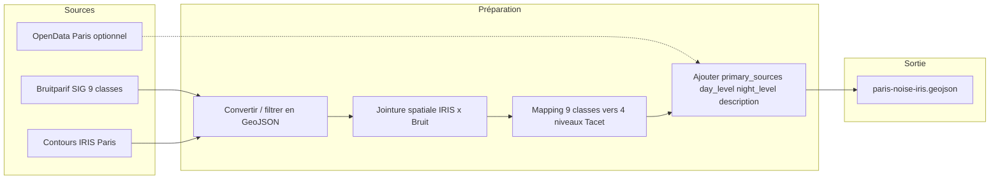

# Vision Tacet, roadmap et préparation paris-noise-iris.geojson

## 1. Vision et contexte projet

**Tacet** = « La carte du silence à Paris » : application (PWA cible) pour visualiser la pollution sonore, explorer les zones calmes et trouver des itinéraires piétons/vélo privilégiant le calme. Positionnement B2C, design-first, open data. Contexte : élections municipales mars 2026.

**État actuel du dépôt** : application **Expo / React Native** (Expo Router, `@rnmapbox/maps`), pas encore Next.js. La spec que vous avez décrite vise une PWA Next.js (V1.0 roadmap) ; le GeoJSON préparé sera réutilisable dans les deux contextes (Expo aujourd'hui, migration Next.js plus tard).

**Roadmap (résumé)**  

- **V0.1** : Fait (prototype 4 écrans).  
- **V0.2** : 2–3 jours — itérations carte, parcours, glass (Rork).  
- **V1.0** : 1–2 semaines — web app fonctionnelle, données Bruitparif réelles, **choropleth IRIS** (Cursor + Next.js).  
- V1.1 / V1.2 / V2.x / V3.0 : routing calme, pédagogie, PWA, NoiseCapture, B2B, etc.

La première étape technique que vous ciblez — **carte + couche choropleth** — correspond à V0.2 (carte) et V1.0 (données réelles). La base de cette couche est le fichier **paris-noise-iris.geojson**.

---

## 2. Objectif du fichier à préparer

**Fichier cible** : `paris-noise-iris.geojson`

- **Géométrie** : polygones IRIS de Paris (~992 zones).  
- **Propriétés attendues** (pour la couche choropleth et le bottom sheet) :
  - `noise_level` : 1–4 (Tacet)  
  - `primary_sources` : tableau (ex. Circulation, Ferroviaire, Aérien, etc.)  
  - `day_level` / `night_level` : si disponible dans les sources  
  - `description` : court texte contextuel (ex. « Plus calme le dimanche matin »)  
  - Identifiant / nom de zone (ex. code IRIS, nom de quartier) pour affichage et légende.

**Mapping Tacet (rappel)**  

| Niveau Tacet | Label        | Couleur | Mapping Bruitparif (à confirmer) |
| ------------ | ------------ | ------- | -------------------------------- |
| 1            | Calme        | #0D9488 | Classes bruit 1–2                |
| 2            | Modéré       | #F59E0B | Classes bruit 3–4                |
| 3            | Bruyant      | #F97316 | Classes bruit 5–6                |
| 4            | Très bruyant | #EF4444 | Classe bruit 7                   |

---

## 3. Sources de données

### 3.1 Bruitparif — cartographie air-bruit (prioritaire)

- **Page** : [bruitparif.fr/opendata-air-bruit](https://www.bruitparif.fr/opendata-air-bruit/)  
- **Contenu** : couches SIG **9 classes** (symbologie 3×3 : 3 niveaux air × 3 niveaux bruit), années **2022** et **2024**.  
- **Codage** : classes 11, 12, 13, 21, 22, 23, 31, 32, 33 (1er chiffre = air, 2e = bruit). Pour Tacet on n'utilise que la **composante bruit** (3 niveaux dans cette nomenclature).  
- **À vérifier** : format des couches (Shapefile / GeoJSON), **granularité géographique** (grille, commune, autre). Si la couche est en grille ou polygones fins, on pourra faire une jointure spatiale avec les IRIS ; si c'est uniquement communal, Paris = une seule commune, donc il faudra coupler avec une autre source (ex. cartes de bruit stratégiques ou OpenData Paris) pour avoir une variation intra-Paris.  
- **Fichier Symbologie** : à télécharger pour confirmer le codage exact et, si besoin, un éventuel lien avec des niveaux Lden (pour passer à 4 niveaux Tacet).

### 3.2 Contours IRIS — Paris

- **Sources possibles** :  
  - [Contours... IRIS®](https://www.data.gouv.fr/fr/datasets/contours-iris-r-2/) (IGN/INSEE, mise à jour récente).  
  - « Contour des IRIS INSEE tout en un » (data.gouv.fr) : un GeoJSON WGS84 complet (fichier lourd) à filtrer sur Paris (code commune **75156**).  
  - Jeu « Contours...Iris® Île-de-France » si disponible : permet de ne télécharger que l'IdF puis filtrer Paris.
- **Objectif** : un GeoJSON des polygones IRIS de Paris avec au minimum code IRIS (et si possible nom de quartier) pour jointure et affichage.

### 3.3 Données complémentaires (optionnel pour V1)

- **Cartes de bruit stratégiques Paris** (data.gouv.fr, DRIEAT) : Shapefile, Lden/Lnight — utile si les couches air-bruit sont uniquement communales, pour obtenir une grille ou des zones à croiser avec les IRIS.  
- **OpenData Paris** (opendata.paris.fr) : indicateurs Lden/Ln, exposition par arrondissement — peut alimenter `day_level` / `night_level` ou `primary_sources` par agrégation (arrondissement → IRIS si possible, sinon par défaut par arrondissement).

---

## 4. Chaîne de traitement proposée

### Étapes détaillées

1. **Télécharger et documenter les jeux**
  - Bruitparif : couche SIG 2024 (ou 2022) 9 classes + fichier Symbologie.  
  - Contours IRIS : Paris uniquement (75156) en GeoJSON (export depuis data.gouv.fr ou conversion Shapefile → GeoJSON si besoin).
2. **Vérifier la géométrie Bruitparif**
  - Si **grille / polygones fins** : jointure spatiale (intersection) avec les IRIS ; pour chaque IRIS, calculer un indicateur dominant (ex. classe la plus représentée en surface, ou médiane) pour la composante bruit.  
  - Si **communal uniquement** : documenter la limite et prévoir soit (a) utilisation des cartes de bruit stratégiques Paris (zones Lden) pour avoir une variation intra-Paris, soit (b) une première version avec une valeur unique Paris + champs `primary_sources` / `day_level` / `night_level` issus d'OpenData Paris par arrondissement, puis affinage quand une source IRIS ou grille sera disponible.
3. **Mapping vers 4 niveaux Tacet**
  - À partir du fichier Symbologie et des métadonnées Bruitparif : définir la règle exacte (3 niveaux Bruitparif → 4 niveaux Tacet, ou 7 niveaux si une autre couche fournit un indice plus fin).  
  - Implémenter la règle dans le script (ex. `noise_level = f(classe_bruitparif)`).
4. **Enrichissement des propriétés**
  - `primary_sources` : si absent des SIG Bruitparif, remplir par défaut (ex. `["Circulation"]`) ou à partir d'OpenData Paris si une table par zone/arrondissement existe.  
  - `day_level` / `night_level` : idem (optionnel V1 si non disponible).  
  - `description` : génération simple à partir de `noise_level` + `primary_sources` (ex. templates par niveau).
5. **Script de production**
  - Langage : **Node.js** (TypeScript) ou **Python** (geopandas, shapely).  
  - Emplacement suggéré : `scripts/` à la racine (ex. `scripts/build-paris-noise-iris.ts` ou `.py`), avec lecture des GeoJSON/Shapefile, jointure spatiale, écriture de `data/paris-noise-iris.geojson`.  
  - Créer le dossier `data/` à la racine (et l'ajouter au dépôt ; les gros fichiers sources peuvent rester en .gitignore avec instructions dans un README ou dans `docs/`).
6. **Validation et reproductibilité**
  - Vérifier que le GeoJSON est valide (schema FeatureCollection, géométries valides, propriétés cohérentes).  
  - Documenter dans `data/README.md` ou `docs/data-bruitparif.md` : sources exactes (URL, date de téléchargement), méthode de jointure, mapping des classes, et citation Bruitparif/Airparif comme demandé.

---

## 5. Points à clarifier avant d'implémenter

- **Format réel des couches Bruitparif** : une fois les fichiers téléchargés depuis bruitparif.fr/opendata-air-bruit/, confirmer si c'est du Shapefile ou du GeoJSON et le nom exact des attributs (ex. `code_9`, `classe`, etc.).  
- **Granularité** : si les couches sont uniquement communales, valider l'option (cartes de bruit stratégiques Paris vs première version avec agrégation arrondissement → affichage par IRIS avec valeur d'arrondissement).  
- **Outillage** : préférence pour un script en **Node/TypeScript** (cohérent avec le stack actuel) ou **Python** (geopandas très adapté aux jointures spatiales) pour la préparation du GeoJSON.

---

## 6. Livrables de cette première étape

- Dossier `**data/**` avec `paris-noise-iris.geojson` (et optionnellement un petit README ou référence dans `docs/`).  
- **Script reproductible** dans `scripts/` pour régénérer le fichier à partir des sources.  
- **Documentation courte** : sources, méthodologie, mapping des classes, citation Bruitparif.  
- Base prête pour l'intégration de la **couche choropleth** dans [components/MapView.tsx](components/MapView.tsx) (ou futur composant dédié type `NoiseLayer`) avec les 4 niveaux et la légende.

Aucune modification du code de l'app n'est incluse dans ce plan ; la phase actuelle se limite à la **préparation du fichier** `paris-noise-iris.geojson`.
